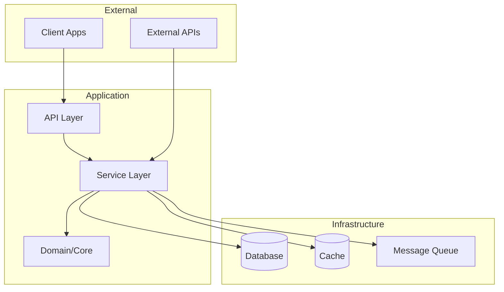
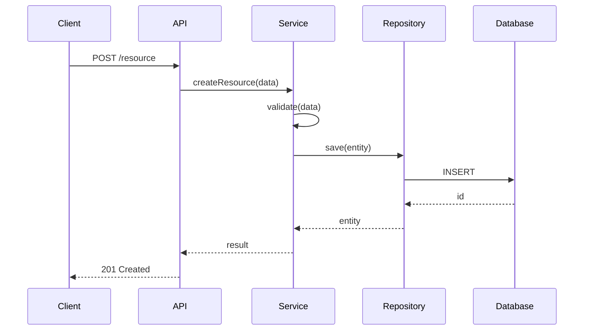

# Generate Architecture Documentation

Description: Performs deep architectural analysis and generates comprehensive architecture documentation including patterns, decisions, and visualizations using a three-phase refinement pipeline.

Arguments:
- scope: (optional) Specific subsystem to document. Defaults to entire project.

---

You are executing a three-phase documentation pipeline. Read CLAUDE.md first for project context, then read `docs/voice/architecture-voice.md` for voice requirements.

---

## PHASE 1: GENERATOR (Draft)

*Persona: Principal Software Architect performing initial analysis*

### Pass 1: Structural Discovery

Map the high-level structure:
```bash
tree -L 3 -I 'node_modules|vendor|.git|dist|build|__pycache__|.venv' --dirsfirst
```

Identify:
- **Entry points**: `main.*`, `index.*`, `app.*`, `server.*`
- **Core domains**: Business logic directories
- **Infrastructure**: Database, cache, queue adapters
- **API layer**: Controllers, routes, handlers
- **Shared utilities**: Common, utils, helpers, lib

### Pass 2: Pattern Recognition

Analyze the codebase for architectural patterns:

| Pattern | Indicators |
|---------|-----------|
| **MVC** | `controllers/`, `models/`, `views/` separation |
| **Clean/Hexagonal** | `domain/`, `application/`, `infrastructure/`, `ports/`, `adapters/` |
| **CQRS** | Separate read/write models, `commands/`, `queries/` |
| **Event-Driven** | `events/`, `handlers/`, `subscribers/`, message queue integration |
| **Microservices** | Independent service directories with own configs |
| **Modular Monolith** | Feature folders with internal layering |
| **Repository Pattern** | `repositories/` or `*Repository.*` files |
| **Service Layer** | `services/` with business logic orchestration |

Read 3-5 representative files to confirm patterns.

### Pass 3: Dependency Mapping

Trace dependencies:
1. Read main entry point
2. Follow primary imports
3. Identify external service integrations (HTTP clients, SDKs)
4. Map database connections
5. Identify message queue/event bus usage

### Pass 4: Data Flow Analysis

Trace one critical write path (e.g., user creation, order placement):
1. API endpoint → Controller
2. Controller → Service/Use Case
3. Service → Repository/Database
4. Side effects (events, notifications, cache invalidation)

### Draft Output

Generate initial `docs/architecture/README.md` with:
- System metaphor (one paragraph)
- Architectural style identification
- High-level Mermaid diagram
- Component catalog table
- Key architectural decisions (minimum 2)
- Data flow sequence diagram
- External integrations table
- Cross-cutting concerns
- Technical constraints
- Areas of complexity

---

## PHASE 2: REFINER (Polish)

*Persona: Technical Editor improving clarity and completeness*

Review the draft against these criteria:

### Clarity Pass

- [ ] Every decision includes rationale (not just "we use X")
- [ ] Diagrams are customized to actual components (not template placeholders)
- [ ] Component responsibilities are specific, not vague ("handles various operations")
- [ ] Technical terms are precise and consistent throughout

### Completeness Pass

- [ ] All major directories appear in component catalog
- [ ] External integrations include configuration details
- [ ] Cross-cutting concerns have implementation specifics
- [ ] Complexity areas have actionable risk levels

### Consistency Pass

- [ ] Terminology matches CLAUDE.md definitions
- [ ] Diagram labels match prose descriptions
- [ ] Table columns are uniformly populated
- [ ] Links to related docs are valid paths

### Enhancement

For each section, ask:
- Is this implementable by someone who hasn't seen the code?
- Would a new architect understand the "why" behind decisions?
- Are there implicit assumptions that should be explicit?

Revise the draft to address any gaps.

---

## PHASE 3: VALIDATOR (QA)

*Persona: Quality Assurance reviewing against voice standards*

### Voice Compliance (from docs/voice/architecture-voice.md)

Verify:
- [ ] No provisional language ("might", "probably", "I think")
- [ ] No rhetorical questions
- [ ] No narrative/storytelling elements ("When we started...")
- [ ] All decisions include rationale
- [ ] Technical terms defined on first use
- [ ] Definitive statements throughout ("The system uses X")

### Anti-Pattern Check

Reject if any of these appear:

| Anti-Pattern | Example | Fix |
|--------------|---------|-----|
| Narrative intrusion | "I've been thinking about..." | Remove, state facts directly |
| Provisional statements | "We should probably use..." | "The system uses..." |
| Missing diagrams | 500+ words without visualization | Add Mermaid diagram |
| Vague components | "handles various operations" | List specific responsibilities |
| Decisions without context | "We use Kubernetes" | Add why + alternatives considered |

### Red Flag Check

If ANY of these are present, return to Phase 2:

- [ ] "I've been thinking about..." (narrative intrusion)
- [ ] "We should probably..." (provisional)
- [ ] "It depends..." without specifying conditions
- [ ] No diagrams in a document over 500 words
- [ ] Components without clear ownership/responsibility
- [ ] Decisions without alternatives considered

### Final Checklist

- [ ] `docs/architecture/README.md` created with full analysis
- [ ] At least 2 Mermaid diagrams embedded (structure + sequence)
- [ ] Component catalog complete for all major directories
- [ ] At least 2 architectural decisions with full rationale
- [ ] Cross-cutting concerns have implementation details
- [ ] Complexity areas flagged with risk levels
- [ ] Voice compliance verified (no red flags)

---

## Output Template

```markdown
# Architecture Overview

> Auto-generated by Autonomous Knowledge Synthesis
> Last updated: [date]

## System Metaphor

[One paragraph describing what this system does and its primary purpose]

## Architectural Style

**Primary Pattern:** [Name the dominant pattern]

[2-3 sentences explaining why this pattern was chosen based on evidence in the code]

## High-Level Structure



[Customize this diagram based on actual discovered components]

## Component Catalog

| Directory | Responsibility | Key Files | Dependencies |
|-----------|---------------|-----------|--------------|
| `src/api/` | HTTP request handling | `routes.ts`, `middleware/` | Services |
| `src/services/` | Business logic orchestration | `UserService.ts` | Domain, Repos |
| ... | ... | ... | ... |

## Key Architectural Decisions

### Decision 1: [Technology/Pattern Choice]
- **Context:** [What problem needed solving]
- **Decision:** [What was chosen]
- **Alternatives Considered:** [What else was evaluated]
- **Evidence:** [File or pattern that demonstrates this]
- **Consequences:** [Trade-offs observed]

### Decision 2: ...

## Data Flow: [Critical Path Name]



[Customize based on actual traced flow]

## External Integrations

| Integration | Purpose | Location | Configuration |
|-------------|---------|----------|---------------|
| [Service name] | [What it does] | `src/integrations/` | `ENV_VAR_NAME` |

## Cross-Cutting Concerns

### Authentication/Authorization
[How auth is implemented - middleware, decorators, guards]

### Error Handling
[Error handling strategy - global handlers, error types]

### Logging & Observability
[Logging approach, tracing, metrics]

### Configuration Management
[How config is loaded - env vars, config files, secrets]

## Technical Constraints

- [Constraint 1 discovered from code]
- [Constraint 2]

## Areas of Complexity

| Area | Complexity Indicator | Risk Level |
|------|---------------------|------------|
| [Component] | [High cyclomatic complexity / deep nesting / many dependencies] | High/Medium/Low |

---

## Related Documentation

- [Developer Setup](../developer/README.md)
- [Infrastructure](../ops/infrastructure.md)
- [ADR Index](./decisions/README.md)
```

---

## Additional Outputs

### ADR Template

Create `docs/architecture/decisions/template.md`:

```markdown
# ADR-[NUMBER]: [TITLE]

## Status
[Proposed | Accepted | Deprecated | Superseded]

## Context
[What is the issue that we're seeing that is motivating this decision?]

## Decision
[What is the change that we're proposing and/or doing?]

## Consequences
[What becomes easier or more difficult because of this change?]

## Alternatives Considered
[What other options were evaluated?]
```

### Diagram Index

Create `docs/architecture/diagrams/README.md`:

```markdown
# Architecture Diagrams

## System Context
- [system-context.md](./system-context.md) - High-level system boundaries

## Component Diagrams
- [component-overview.md](./component-overview.md) - Internal component structure

## Sequence Diagrams
- [user-registration.md](./user-registration.md) - User registration flow
- [Add more as generated]

## Data Models
- [entity-relationship.md](./entity-relationship.md) - Core data entities
```
