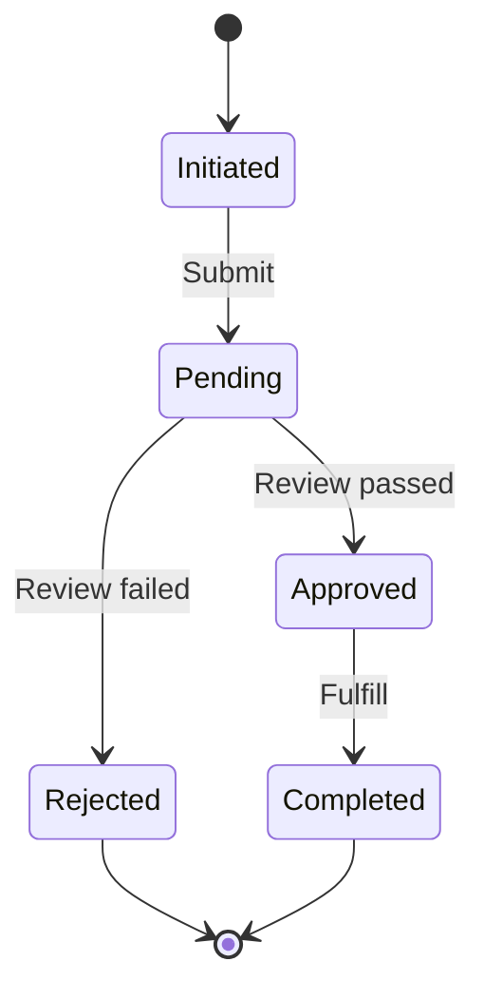

# Generate Functional Documentation

Description: Extracts and documents business logic, rules, and functional specifications from code implementation using a three-phase refinement pipeline.

Arguments:
- domain: (optional) Specific domain/module to analyze (e.g., "pricing", "auth", "orders").
- output-format: (optional) "technical" for developers or "business" for stakeholders. Defaults to "business".

---

You are executing a three-phase documentation pipeline. Read CLAUDE.md first for project context, then read `docs/voice/functional-voice.md` for voice requirements.

---

## THREE-PHASE PIPELINE

### PHASE 1: GENERATOR
*Persona: Business Analyst creating initial draft*
- Execute the Analysis Protocol below
- Generate draft documentation for all output files

### PHASE 2: REFINER
*Persona: Technical Editor translating to business language*
- All rules expressed in When/Then format
- No code terminology (variables, functions, databases)
- Workflows visualized with state diagrams
- Calculations explained with concrete examples

### PHASE 3: VALIDATOR
*Persona: QA reviewing against voice standards (see docs/voice/functional-voice.md)*

**Anti-Patterns to Reject:**
| Anti-Pattern | Example | Fix |
|--------------|---------|-----|
| Technical details | "The OrderService calls the PaymentGateway API" | "When a customer submits an order, the system charges their payment method" |
| Jargon without translation | "eventual consistency" | "Inventory counts may take up to 5 seconds to reflect a purchase" |
| Missing edge cases | "Customers can cancel orders" | Add conditions: within 5 min, after shipping, etc. |
| Vague behavior | "The system validates the input" | Specific validation rules with examples |

**Red Flags (Return to Phase 2):**
- [ ] Code snippets anywhere in the document
- [ ] References to databases, APIs, or services
- [ ] "The backend handles..." or similar
- [ ] Business rules without testable conditions
- [ ] Features described that don't exist yet

---

## Core Principle

**Translate implementation into intent.**

Your output must be readable by non-technical stakeholders. Never mention:
- Variable names, arrays, loops, conditionals (as code concepts)
- Database tables, columns, SQL
- HTTP methods, status codes, endpoints
- Classes, functions, methods

Instead describe:
- Business rules and their conditions
- User capabilities and restrictions
- System behaviors and outcomes
- Data validation requirements

---

## Analysis Protocol

### Step 1: Domain Identification

If no specific domain provided, scan for business logic locations:

| Pattern | Likely Contains Business Logic |
|---------|-------------------------------|
| `services/`, `usecases/`, `domain/` | Core business operations |
| `validators/`, `rules/` | Validation rules |
| `policies/`, `permissions/` | Access control rules |
| `pricing/`, `billing/` | Financial calculations |
| `workflows/`, `state-machines/` | Process flows |

### Step 2: Rule Extraction

For each service/domain file:

1. **Read the file**
2. **Identify decision points** (conditions that affect outcomes)
3. **Extract validation rules** (what makes data valid/invalid)
4. **Map workflows** (sequences of operations)
5. **Document calculations** (formulas, algorithms)

### Step 3: Translation

Convert code logic to business language:

| Code Pattern | Business Translation |
|--------------|---------------------|
| `if (user.role === 'admin')` | "Administrators can..." |
| `if (order.total > 100)` | "Orders exceeding $100..." |
| `throw new Error('Invalid')` | "The system rejects... when..." |
| `return price * 0.9` | "A 10% discount is applied..." |
| `status = 'pending'` | "The request enters a pending state..." |

---

## Output: docs/functional/README.md

```markdown
# Functional Specifications

> Auto-generated by Autonomous Knowledge Synthesis
> Last updated: [date]

## Overview

This document describes the business rules and system behaviors implemented in [Project Name]. It is intended for product managers, business stakeholders, and new team members seeking to understand what the system does (not how it's built).

## Domain Index

| Domain | Description | Spec |
|--------|-------------|------|
| [User Management] | User registration, authentication, permissions | [Link](./business-rules/users.md) |
| [Orders] | Order creation, processing, fulfillment | [Link](./business-rules/orders.md) |
| [Pricing] | Discounts, promotions, calculations | [Link](./business-rules/pricing.md) |

## Cross-Domain Rules

### Data Validation Standards

| Field Type | Rules |
|------------|-------|
| Email addresses | Must be valid format, unique in system |
| Phone numbers | [Country-specific format requirements] |
| Dates | [Timezone handling, format requirements] |
| Currency | [Precision, rounding rules] |

### Universal Constraints

- [System-wide business rules that apply everywhere]
- [Global limits or restrictions]
```

---

## Output: docs/functional/business-rules/[domain].md

For each identified domain, create a specification:

```markdown
# [Domain Name] - Functional Specification

## Purpose

[One paragraph describing what this domain handles and why it exists]

## Actors

| Actor | Description |
|-------|-------------|
| Guest | Unauthenticated visitor |
| User | Registered, logged-in customer |
| Admin | System administrator |

## Capabilities by Actor

### Guest Can:
- [Action 1]
- [Action 2]

### User Can:
- [Everything Guest can do, plus:]
- [Action 3]
- [Action 4]

### Admin Can:
- [Everything User can do, plus:]
- [Action 5]

## Business Rules

### Rule 1: [Rule Name]

**Condition:** [When this rule applies]

**Behavior:** [What happens]

**Example:**
> [Concrete scenario illustrating the rule]

**Exceptions:**
- [Any exceptions to this rule]

---

### Rule 2: [Rule Name]

[Same structure]

---

## Validation Requirements

### [Entity Name] Validation

| Field | Required | Rules |
|-------|----------|-------|
| Name | Yes | Between 2-100 characters |
| Email | Yes | Valid email format, must be unique |
| Age | No | If provided, must be 18 or older |

### Error Conditions

| Condition | System Response |
|-----------|-----------------|
| Email already registered | Informs user to log in or reset password |
| Invalid payment method | Requests alternative payment |

## Workflows

### [Workflow Name] Process



**State Descriptions:**

| State | Meaning | Allowed Actions |
|-------|---------|-----------------|
| Initiated | Request created but not submitted | Edit, Delete, Submit |
| Pending | Awaiting review | Cancel |
| Approved | Ready for fulfillment | None (automatic) |
| Rejected | Did not pass review | Appeal, Resubmit |
| Completed | Successfully fulfilled | View history |

**Transitions:**

| From | To | Trigger | Conditions |
|------|-----|---------|------------|
| Initiated | Pending | User submits | All required fields valid |
| Pending | Approved | Reviewer approves | Passes all checks |
| Pending | Rejected | Reviewer rejects | Fails any check |

## Calculations

### [Calculation Name]

**Purpose:** [What this calculation determines]

**Formula:**
> [Business-friendly description]

**Components:**

| Component | Description |
|-----------|-------------|
| Base Amount | [What it represents] |
| Modifier | [What affects it] |
| Result | [What is produced] |

**Example:**
> For an order of $100 with a Gold membership:
> - Base: $100
> - Membership discount: 20%
> - Final: $80

## Business Glossary

| Term | Definition |
|------|------------|
| [Term 1] | [Definition used in this domain] |
| [Term 2] | [Definition] |

## Compliance Notes

[Any regulatory or compliance requirements affecting this domain]

- [GDPR requirements]
- [PCI-DSS requirements]
- [Industry-specific regulations]

## Change History

| Date | Change | Impact |
|------|--------|--------|
| [Date] | [Rule changed] | [Affected areas] |

---

## Related Specifications

- [Related Domain 1](./related-domain.md)
- [System Architecture](../../architecture/README.md)
```

---

## Completion Checklist

- [ ] `docs/functional/README.md` - Domain index
- [ ] Business rules for each major domain
- [ ] All rules expressed in business language (no code terminology)
- [ ] Workflows visualized with state diagrams
- [ ] Calculations explained with examples
- [ ] Validation requirements tables
- [ ] Glossary of business terms
