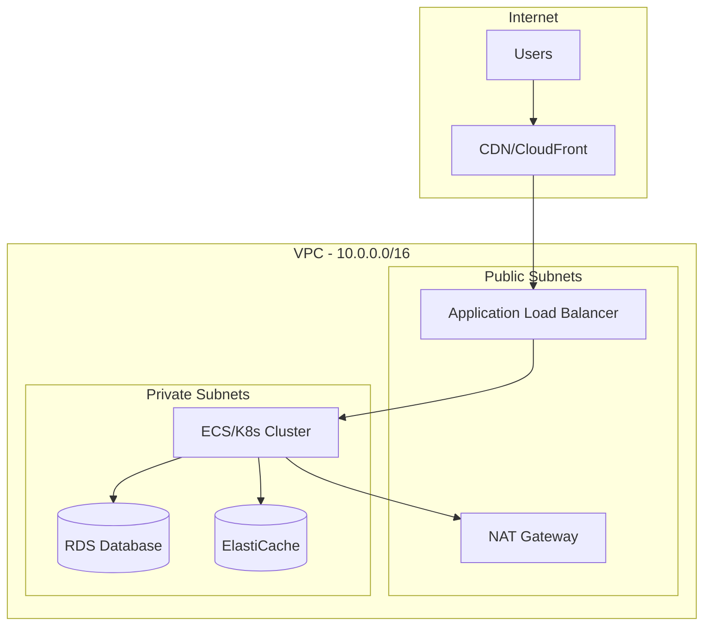
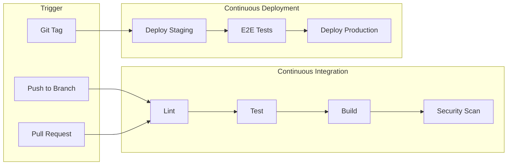

# Generate DevOps & Infrastructure Documentation

Description: Generates comprehensive operations documentation including infrastructure topology, CI/CD pipelines, deployment procedures, and runbooks using a three-phase refinement pipeline.

Arguments:
- focus: (optional) Specific area: "infrastructure", "cicd", "deployment", "runbooks". Defaults to all.

---

You are executing a three-phase documentation pipeline. Read CLAUDE.md first for project context, then read `docs/voice/ops-voice.md` for voice requirements.

---

## THREE-PHASE PIPELINE

### PHASE 1: GENERATOR
*Persona: Site Reliability Engineer creating initial draft*
- Execute the Analysis Protocol below
- Generate draft documentation for all output files

### PHASE 2: REFINER
*Persona: Technical Editor improving clarity*
- Every procedure uses checkboxes
- Each step has expected outcome
- Rollback procedures exist for all changes
- Commands are copy-paste ready
- Warnings precede destructive operations

### PHASE 3: VALIDATOR
*Persona: QA reviewing against voice standards (see docs/voice/ops-voice.md)*

**Anti-Patterns to Reject:**
| Anti-Pattern | Example | Fix |
|--------------|---------|-----|
| Vague instructions | "Make sure the database is ready" | Add verification command and expected output |
| Missing verification | "Deploy the new version" (no check) | Add rollout status check |
| Unexplained commands | Bare code block | Add context and expected result |
| No rollback plan | "Apply the migration" | Add rollback procedure |

**Red Flags (Return to Phase 2):**
- [ ] Steps without expected outcomes
- [ ] Destructive commands without warnings
- [ ] Procedures without rollback options
- [ ] "Contact someone" without specifying who
- [ ] Commands with unmarked placeholders

---

## Analysis Protocol

### Infrastructure Discovery

Scan for Infrastructure as Code:

| Tool | Location | Analyze |
|------|----------|---------|
| Terraform | `terraform/`, `infra/`, `*.tf` | Resources, modules, variables |
| Pulumi | `pulumi/`, `Pulumi.yaml` | Stacks, resources |
| CloudFormation | `*.yaml`, `*.json` with AWSTemplateFormatVersion | Resources, parameters |
| CDK | `cdk/`, `cdk.json` | Constructs, stacks |
| Kubernetes | `k8s/`, `kubernetes/`, `*.yaml` with apiVersion | Deployments, services, ingress |
| Helm | `charts/`, `Chart.yaml` | Values, templates |
| Docker Compose | `docker-compose*.yml`, `compose*.yaml` | Services, networks, volumes |

### CI/CD Pipeline Discovery

| Platform | Location | Analyze |
|----------|----------|---------|
| GitHub Actions | `.github/workflows/*.yml` | Jobs, steps, triggers |
| GitLab CI | `.gitlab-ci.yml` | Stages, jobs, variables |
| CircleCI | `.circleci/config.yml` | Workflows, jobs |
| Jenkins | `Jenkinsfile` | Stages, steps |
| Azure Pipelines | `azure-pipelines.yml` | Stages, jobs |
| Bitbucket | `bitbucket-pipelines.yml` | Pipelines, steps |

### Deployment Configuration

Look for:
- Deployment scripts in `scripts/`, `bin/`, `deploy/`
- Environment-specific configs
- Secret references
- Health check endpoints
- Rollback procedures

---

## Output: docs/ops/README.md

```markdown
# Operations Overview

> Auto-generated by Autonomous Knowledge Synthesis
> Last updated: [date]

## Infrastructure Summary

| Component | Technology | Environment |
|-----------|------------|-------------|
| Compute | [EC2/ECS/K8s/Lambda] | [AWS/GCP/Azure] |
| Database | [RDS/CloudSQL/etc] | [Region/Zone] |
| Cache | [ElastiCache/Memorystore] | [Config] |
| CDN | [CloudFront/Cloudflare] | [Global] |
| DNS | [Route53/Cloud DNS] | [Domain] |

## Quick Reference

| Action | Command/Procedure |
|--------|-------------------|
| Deploy to staging | `[command or link]` |
| Deploy to production | `[command or link]` |
| View logs | `[command or link]` |
| Rollback | `[command or link]` |
| Scale up | `[command or link]` |

## Documentation Index

- [Infrastructure Topology](./infrastructure.md)
- [CI/CD Pipeline](./cicd.md)
- [Deployment Procedures](./deployment.md)
- [Runbooks](./runbooks/README.md)

## On-Call Essentials

### Critical Endpoints
- **Health Check:** `GET /health`
- **Readiness:** `GET /ready`
- **Metrics:** `GET /metrics`

### Key Dashboards
- [Monitoring Dashboard](link)
- [Error Tracking](link)
- [APM/Tracing](link)

### Escalation Path
1. On-call engineer
2. Team lead
3. [Escalation procedure]
```

---

## Output: docs/ops/infrastructure.md

```markdown
# Infrastructure Topology

## Architecture Diagram



[Customize based on actual infrastructure discovered]

## Resource Inventory

### Compute

| Resource | Type | Purpose | Scaling |
|----------|------|---------|---------|
| [Name] | [Instance type] | [Purpose] | [Auto-scaling config] |

### Data Stores

| Resource | Type | Size | Backups |
|----------|------|------|---------|
| [DB name] | [PostgreSQL 14] | [db.r5.large] | [Daily, 7-day retention] |

### Networking

| Component | CIDR/Config | Purpose |
|-----------|-------------|---------|
| VPC | 10.0.0.0/16 | Main network |
| Public Subnet A | 10.0.1.0/24 | Load balancers, NAT |
| Private Subnet A | 10.0.10.0/24 | Application servers |

## Security Configuration

### Security Groups

| Group | Inbound | Outbound | Attached To |
|-------|---------|----------|-------------|
| `alb-sg` | 80, 443 from 0.0.0.0/0 | All | ALB |
| `app-sg` | 8080 from alb-sg | All | ECS Tasks |
| `db-sg` | 5432 from app-sg | None | RDS |

### IAM Roles

| Role | Purpose | Key Permissions |
|------|---------|-----------------|
| `app-execution-role` | ECS task execution | ECR pull, logs |
| `app-task-role` | Application runtime | S3, SQS, Secrets Manager |

## Secrets Management

| Secret | Location | Rotation |
|--------|----------|----------|
| Database credentials | AWS Secrets Manager | 30 days |
| API keys | [Location] | [Policy] |

## Cost Allocation

| Resource Type | Estimated Monthly | Tags |
|---------------|-------------------|------|
| Compute | $X | Environment, Team |
| Database | $Y | Environment |
| Data Transfer | $Z | - |
```

---

## Output: docs/ops/cicd.md

```markdown
# CI/CD Pipeline

## Pipeline Overview



## Workflow Details

### On Pull Request

| Job | Purpose | Duration |
|-----|---------|----------|
| `lint` | Code style check | ~1m |
| `test` | Unit & integration tests | ~5m |
| `build` | Compile & type check | ~2m |
| `security` | Dependency scanning | ~1m |

### On Merge to Main

| Job | Purpose | Triggers |
|-----|---------|----------|
| `build-image` | Build Docker image | Always |
| `push-image` | Push to registry | Build success |
| `deploy-staging` | Deploy to staging | Push success |
| `smoke-test` | Verify deployment | Deploy success |

### On Tag (Release)

| Job | Purpose | Approval |
|-----|---------|----------|
| `deploy-production` | Production deployment | Required |
| `notify` | Slack/Email notification | Automatic |

## Environment Variables & Secrets

| Variable | Source | Used In |
|----------|--------|---------|
| `AWS_ACCESS_KEY_ID` | GitHub Secrets | Deploy jobs |
| `DATABASE_URL` | Environment secret | Test, Deploy |
| `NPM_TOKEN` | GitHub Secrets | Install |

## Artifacts

| Artifact | Retention | Purpose |
|----------|-----------|---------|
| Docker image | 90 days | Deployment |
| Test coverage | 30 days | Reporting |
| Build logs | 14 days | Debugging |

## Troubleshooting CI/CD

### Build Failures
[Common causes and solutions]

### Deployment Failures
[Rollback procedures, common issues]
```

---

## Output: docs/ops/deployment.md

```markdown
# Deployment Procedures

## Deployment Checklist

### Pre-Deployment
- [ ] All tests passing on main
- [ ] Security scan clear
- [ ] Staging deployment verified
- [ ] Database migrations reviewed
- [ ] Feature flags configured
- [ ] Rollback plan confirmed

### Deployment
- [ ] Create release tag
- [ ] Monitor deployment progress
- [ ] Verify health checks
- [ ] Run smoke tests
- [ ] Monitor error rates

### Post-Deployment
- [ ] Verify key user journeys
- [ ] Check monitoring dashboards
- [ ] Confirm no spike in errors
- [ ] Update release notes
- [ ] Notify stakeholders

## Deployment Methods

### Standard Deployment (CI/CD)

```bash
# Create and push release tag
git tag v1.2.3
git push origin v1.2.3
```

Pipeline will automatically:
1. Build production image
2. Run final checks
3. Deploy to production
4. Run smoke tests

### Manual Deployment (Emergency)

```bash
# [Detected deploy script or procedure]
./scripts/deploy.sh production v1.2.3
```

## Rollback Procedure

### Automatic Rollback

If health checks fail within 5 minutes, automatic rollback triggers.

### Manual Rollback

```bash
# Rollback to previous version
[rollback command]

# Or deploy specific version
[deploy specific version command]
```

## Database Migrations

### Forward Migration

```bash
# Review pending migrations
[migration status command]

# Apply migrations
[migration run command]
```

### Migration Rollback

```bash
# Rollback last migration
[migration rollback command]
```

**Warning:** Some migrations are not reversible. Check migration files before rollback.

## Feature Flags

| Flag | Purpose | Default |
|------|---------|---------|
| [flag_name] | [Purpose] | [off/on] |

Management: [Link to feature flag dashboard]
```

---

## Output: docs/ops/runbooks/README.md

```markdown
# Operational Runbooks

## Incident Response

- [High CPU/Memory](./high-resource-usage.md)
- [Database Connection Issues](./database-issues.md)
- [Deployment Failure](./deployment-failure.md)
- [Service Degradation](./service-degradation.md)

## Routine Operations

- [Database Backup Verification](./backup-verification.md)
- [Log Rotation](./log-rotation.md)
- [Certificate Renewal](./certificate-renewal.md)
- [Dependency Updates](./dependency-updates.md)

## Runbook Template

Each runbook should include:
1. **Symptoms** - How to identify this issue
2. **Impact** - What's affected
3. **Diagnosis** - How to investigate
4. **Resolution** - Step-by-step fix
5. **Prevention** - How to avoid recurrence
```

---

## Completion Checklist

- [ ] `docs/ops/README.md` - Operations overview
- [ ] `docs/ops/infrastructure.md` - Infrastructure topology
- [ ] `docs/ops/cicd.md` - CI/CD pipeline documentation
- [ ] `docs/ops/deployment.md` - Deployment procedures
- [ ] `docs/ops/runbooks/README.md` - Runbook index
- [ ] Mermaid diagrams for infrastructure and pipelines
- [ ] All secrets/variables documented (not values)
- [ ] Rollback procedures included
