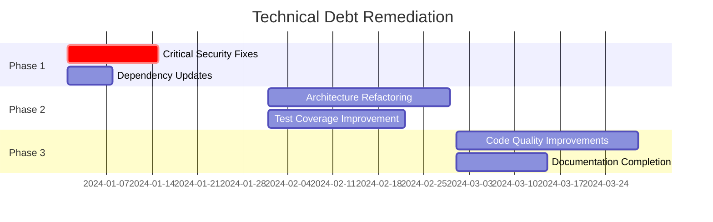

# Generate Strategic Documentation

Description: Performs technical debt analysis and generates strategic roadmap documentation including health assessment, risk identification, and remediation planning using a three-phase refinement pipeline.

Arguments:
- depth: (optional) "quick" for overview, "deep" for comprehensive analysis. Defaults to "deep".
- focus: (optional) Specific area to analyze: "debt", "dependencies", "security", "performance".

---

You are executing a three-phase documentation pipeline. Read CLAUDE.md first for project context, then read `docs/voice/strategic-voice.md` for voice requirements.

---

## THREE-PHASE PIPELINE

### PHASE 1: GENERATOR
*Persona: CTO Advisor creating initial draft*
- Execute the Analysis Protocol below
- Generate draft documentation for all output files

### PHASE 2: REFINER
*Persona: Executive Communication Specialist*
- Executive summary leads with overall assessment
- Business impact quantified where possible
- Clear prioritization (not everything is critical)
- Recommendations are actionable with effort estimates

### PHASE 3: VALIDATOR
*Persona: QA reviewing against voice standards (see docs/voice/strategic-voice.md)*

**Anti-Patterns to Reject:**
| Anti-Pattern | Example | Fix |
|--------------|---------|-----|
| Technical deep-dives | "The ORM uses N+1 query patterns..." | "Database queries are inefficient, fix requires 4 weeks" |
| Fear-mongering | "The system could collapse at any moment" | Quantified risk with probability and mitigation |
| Unbounded problems | "We have a lot of technical debt" | "12 items identified: 2 critical, 4 high, 6 medium" |
| Missing business context | "We should upgrade to PostgreSQL 15" | Add why + business benefits + cost |

**Red Flags (Return to Phase 2):**
- [ ] No executive summary
- [ ] Technical details without business context
- [ ] All items marked as critical priority
- [ ] Problems without recommended solutions
- [ ] Missing cost estimates for remediation
- [ ] No timeline for action

---

## Analysis Protocol

### Pass 1: Code Health Indicators

Scan for complexity and maintainability issues:

```bash
# Find large files (potential god classes/modules)
find . -name "*.ts" -o -name "*.js" -o -name "*.py" -o -name "*.go" | xargs wc -l | sort -rn | head -20

# Find deeply nested directories (potential over-engineering)
find . -type d | awk -F/ 'NF > 6' | head -20
```

### Pass 2: Technical Debt Markers

Search for explicit debt acknowledgments:
```bash
grep -rn "TODO\|FIXME\|HACK\|XXX\|TEMP\|WORKAROUND" --include="*.ts" --include="*.js" --include="*.py" --include="*.go" | head -50
```

Categorize findings:
- **Intentional Shortcuts**: `TEMP`, `WORKAROUND`
- **Known Bugs**: `FIXME`, `BUG`
- **Improvement Ideas**: `TODO`, `ENHANCEMENT`
- **Code Smells**: `HACK`, `XXX`

### Pass 3: Dependency Analysis

Analyze dependencies for:
- **Outdated packages** (check for major version drift)
- **Deprecated packages** (abandoned, security warnings)
- **Duplicate functionality** (multiple libs doing same thing)
- **License issues** (incompatible licenses)

### Pass 4: Security Indicators

Look for:
- Hardcoded secrets patterns
- SQL string concatenation
- `eval()` or similar dangerous functions
- Disabled security features (CORS, CSRF)
- Outdated dependencies with known CVEs

### Pass 5: Architecture Debt

Identify:
- Circular dependencies
- God classes/modules (>500 lines)
- Dead code (unused exports)
- Inconsistent patterns

---

## Output: docs/strategic/README.md

```markdown
# Strategic Technical Assessment

> Auto-generated by Autonomous Knowledge Synthesis
> Last updated: [date]

## Executive Summary

### Overall Health Score: [X/10]

| Dimension | Score | Status |
|-----------|-------|--------|
| Code Quality | [X/10] | [Green/Yellow/Red] |
| Test Coverage | [X/10] | [Green/Yellow/Red] |
| Dependency Health | [X/10] | [Green/Yellow/Red] |
| Security Posture | [X/10] | [Green/Yellow/Red] |
| Documentation | [X/10] | [Green/Yellow/Red] |
| Architecture | [X/10] | [Green/Yellow/Red] |

### Key Findings

1. **[Most Critical Finding]** - [One sentence summary]
2. **[Second Finding]** - [One sentence summary]
3. **[Third Finding]** - [One sentence summary]

### Recommended Actions

| Priority | Action | Effort | Impact |
|----------|--------|--------|--------|
| Critical | [Action] | [S/M/L] | [High/Med/Low] |
| High | [Action] | [S/M/L] | [High/Med/Low] |
| Medium | [Action] | [S/M/L] | [High/Med/Low] |

## Documentation Index

- [Technical Debt Inventory](./tech-debt.md)
- [Remediation Roadmap](./roadmap.md)
- [Dependency Analysis](./dependencies.md)
- [Security Assessment](./security.md)
```

---

## Output: docs/strategic/tech-debt.md

```markdown
# Technical Debt Inventory

## Debt Classification

### Legend

| Severity | Impact | Interest Rate |
|----------|--------|---------------|
| Critical | Blocks major features or causes outages | Compounds weekly |
| High | Slows development significantly | Compounds monthly |
| Medium | Causes friction, code quality issues | Compounds quarterly |
| Low | Minor inconveniences | Stable |

## Debt Items

### Critical Debt

#### DEBT-001: [Title]

**Location:** `src/path/to/file.ts:123`

**Type:** [Architecture / Code Quality / Dependencies / Security]

**Description:**
[What the debt is and how it manifests]

**Impact:**
- [How it affects development]
- [Risk if not addressed]

**Root Cause:**
[Why this debt exists - time pressure, changing requirements, etc.]

**Remediation:**
[Steps to address]

**Estimated Effort:** [X hours/days]

---

### High Debt

#### DEBT-002: [Title]
[Same structure]

---

### Medium Debt

#### DEBT-003: [Title]
[Same structure]

---

## Debt by Category

### Architecture Debt

| ID | Description | Severity | Effort |
|----|-------------|----------|--------|
| DEBT-001 | [Brief] | Critical | 3 days |

### Code Quality Debt

| ID | Description | Severity | Effort |
|----|-------------|----------|--------|
| DEBT-004 | [Brief] | Medium | 1 day |

### Dependency Debt

| ID | Description | Severity | Effort |
|----|-------------|----------|--------|
| DEBT-007 | [Brief] | High | 2 days |

## Debt Metrics

### TODO/FIXME Density

| Directory | Count | Per 1K Lines |
|-----------|-------|--------------|
| `src/legacy/` | 45 | 12.3 |
| `src/api/` | 12 | 2.1 |
| `src/utils/` | 3 | 0.8 |

### Large Files (>500 lines)

| File | Lines | Recommendation |
|------|-------|----------------|
| `src/legacy/monolith.ts` | 2,340 | Split into modules |
| `src/services/order.ts` | 890 | Extract concerns |

### Circular Dependencies

[List any circular dependency chains discovered]

## Historical Context

[Any known history of why certain debts accumulated]
```

---

## Output: docs/strategic/roadmap.md

```markdown
# Technical Remediation Roadmap

## Roadmap Overview



## Phase 1: Stabilization (Immediate)

**Goal:** Eliminate critical risks and security vulnerabilities

**Duration:** 2 weeks

| Task | Owner | Status | Debt IDs |
|------|-------|--------|----------|
| Update vulnerable dependencies | - | Pending | DEBT-010, DEBT-011 |
| Fix SQL injection vulnerability | - | Pending | DEBT-015 |
| Add missing authentication checks | - | Pending | DEBT-016 |

**Success Criteria:**
- [ ] No critical security vulnerabilities
- [ ] All dependencies on supported versions
- [ ] Security scan passes

## Phase 2: Consolidation (Short-term)

**Goal:** Reduce development friction and improve maintainability

**Duration:** 4 weeks

| Task | Owner | Status | Debt IDs |
|------|-------|--------|----------|
| Refactor OrderService (890 lines) | - | Pending | DEBT-003 |
| Extract shared utilities | - | Pending | DEBT-005 |
| Increase test coverage to 70% | - | Pending | DEBT-008 |

**Success Criteria:**
- [ ] No files over 500 lines
- [ ] Test coverage > 70%
- [ ] Build time reduced by 20%

## Phase 3: Modernization (Medium-term)

**Goal:** Upgrade architecture and eliminate legacy patterns

**Duration:** 6 weeks

| Task | Owner | Status | Debt IDs |
|------|-------|--------|----------|
| Migrate legacy module | - | Pending | DEBT-001 |
| Implement proper caching | - | Pending | DEBT-012 |
| Complete API documentation | - | Pending | DEBT-020 |

**Success Criteria:**
- [ ] Legacy module fully migrated
- [ ] API response time < 200ms p95
- [ ] 100% API documentation coverage

## Investment Justification

### Cost of Inaction

| Debt Type | Current Cost | Projected Cost (6mo) | Projected Cost (1yr) |
|-----------|--------------|---------------------|----------------------|
| Development velocity | -15% | -25% | -40% |
| Bug fix time | +30% | +50% | +100% |
| Onboarding time | 3 weeks | 4 weeks | 6 weeks |

### Return on Investment

| Investment | Benefit |
|------------|---------|
| 2 weeks security fixes | Prevent potential breach (est. $XXX cost) |
| 4 weeks refactoring | 30% faster feature development |
| 3 weeks testing | 50% fewer production bugs |

## Resource Requirements

| Phase | Engineers | Duration | Total Days |
|-------|-----------|----------|------------|
| Phase 1 | 2 | 2 weeks | 20 |
| Phase 2 | 3 | 4 weeks | 60 |
| Phase 3 | 2 | 6 weeks | 60 |
| **Total** | - | - | **140** |

## Risk Mitigation

| Risk | Mitigation |
|------|------------|
| Refactoring introduces bugs | Increase test coverage before refactoring |
| Timeline slippage | Break into smaller increments, ship continuously |
| Knowledge silos | Pair programming, documentation during work |

## Tracking & Governance

### Weekly Check-ins
- Review progress against plan
- Identify blockers
- Adjust priorities if needed

### Definition of Done
- Code merged to main
- Tests passing
- Documentation updated
- Debt item marked complete
```

---

## Completion Checklist

- [ ] `docs/strategic/README.md` - Executive summary with health score
- [ ] `docs/strategic/tech-debt.md` - Complete debt inventory
- [ ] `docs/strategic/roadmap.md` - Phased remediation plan
- [ ] All debt items categorized and prioritized
- [ ] Effort estimates provided
- [ ] Business justification included
- [ ] Success criteria defined for each phase
