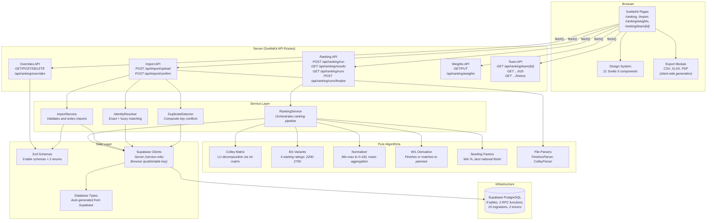
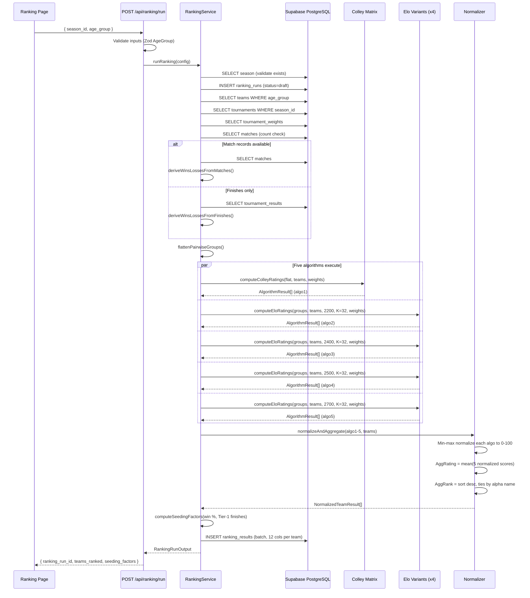
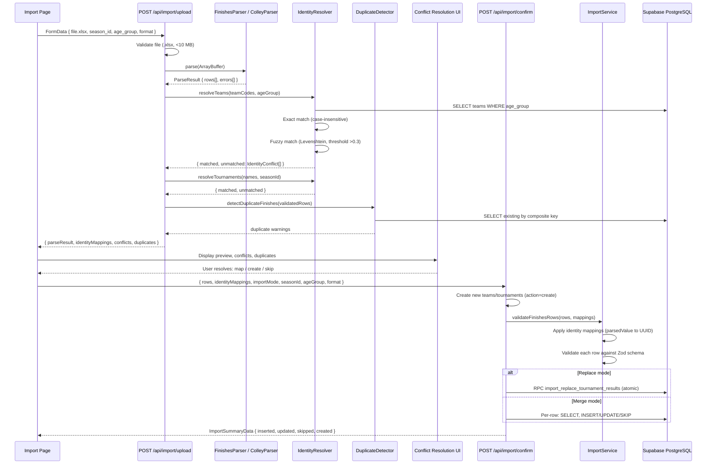

# Architecture Overview

> Last updated: 2026-02-24

## System Metaphor

The Volleyball Ranking Engine is a decision-support tool that transforms raw tournament placement data into defensible, multi-perspective team rankings for AAU volleyball. It operates as a data pipeline: XLSX spreadsheets enter through a two-phase import process with identity resolution, flow through a five-algorithm ensemble (Colley Matrix plus four Elo variants), and exit as normalized, committee-reviewable rankings exportable to CSV, XLSX, and PDF. The system serves a single user group -- the AAU ranking committee -- and its sole infrastructure dependency is a Supabase-hosted PostgreSQL database.

## Architectural Style

**SvelteKit file-based routing monolith with service layer pattern.**

The application deploys as a single SvelteKit 2 artifact. SvelteKit's file-system routing maps URLs directly to page components and API endpoints. Business logic lives in a service layer (`src/lib/`) that separates pure algorithm functions from I/O-performing service classes. The service layer communicates exclusively with Supabase (hosted PostgreSQL) through the `@supabase/supabase-js` client library.

Key architectural properties:

- **No microservices.** A single deployment handles SSR pages, API routes, and static assets.
- **No authentication.** The system relies on network-level access control.
- **No SSR for data-heavy pages.** Ranking and import pages use `+page.server.ts` load functions for initial data, with subsequent interactions handled through client-side `fetch()` calls to API routes.
- **Pure/impure separation.** Algorithm functions (`colley.ts`, `elo.ts`, `normalize.ts`, `seeding-factors.ts`) are pure -- they accept data and return results with zero side effects. Service classes (`RankingService`, `ImportService`, `IdentityResolver`) perform database I/O.

## High-Level Structure

## Component Catalog

| Directory | Responsibility | Key Files | Dependencies |
|-----------|---------------|-----------|-------------|
| `src/routes/ranking/` | Rankings dashboard, team detail page, weights editor | `+page.svelte`, `+page.server.ts`, `team/[id]/+page.svelte`, `weights/+page.svelte` | Design system components, Ranking API, Export module |
| `src/routes/import/` | File upload page with preview and identity resolution UI | `+page.svelte`, `+page.server.ts` | Design system components, Import API |
| `src/routes/api/ranking/` | REST API for ranking computation, results, runs, overrides, weights, team detail | `run/+server.ts`, `results/+server.ts`, `runs/+server.ts`, `runs/finalize/+server.ts`, `overrides/+server.ts`, `weights/+server.ts`, `team/[id]/+server.ts`, `team/[id]/h2h/+server.ts`, `team/[id]/history/+server.ts` | RankingService, Zod schemas, supabase-server |
| `src/routes/api/import/` | REST API for two-phase import (upload + confirm) | `upload/+server.ts`, `confirm/+server.ts` | ImportService, IdentityResolver, DuplicateDetector, Parsers |
| `src/lib/ranking/` | Core ranking algorithms, normalization, aggregation, orchestration | `ranking-service.ts`, `colley.ts`, `elo.ts`, `normalize.ts`, `derive-wins-losses.ts`, `seeding-factors.ts`, `table-utils.ts`, `types.ts` | ml-matrix (Colley only), Zod enums, Supabase client (service only) |
| `src/lib/import/` | XLSX parsing, identity resolution, duplicate detection, import execution | `import-service.ts`, `identity-resolver.ts`, `duplicate-detector.ts`, `types.ts`, `parsers/finishes-parser.ts`, `parsers/colley-parser.ts`, `parsers/match-parser.ts`, `parsers/index.ts` | Zod schemas, Supabase client |
| `src/lib/export/` | CSV, XLSX, and PDF report generation | `export-data.ts`, `csv.ts`, `xlsx.ts`, `pdf.ts`, `download.ts`, `types.ts`, `index.ts` | table-utils (computeFinalRanks), jspdf, jspdf-autotable, xlsx |
| `src/lib/components/` | Reusable Svelte 5 UI components (design system) | `Button.svelte`, `Card.svelte`, `DataTable.svelte`, `RankingResultsTable.svelte`, `OverridePanel.svelte`, `FileDropZone.svelte`, `IdentityResolutionPanel.svelte`, `ExportDropdown.svelte`, `NavHeader.svelte`, `PageShell.svelte`, `Select.svelte`, `Spinner.svelte`, `Banner.svelte`, `RankBadge.svelte`, `TierRow.svelte`, `FreshnessIndicator.svelte`, `PageHeader.svelte`, `DataPreviewTable.svelte`, `ImportSummary.svelte` | Tailwind CSS 4, Svelte 5 runes |
| `src/lib/schemas/` | Zod validation schemas for all database entities | `enums.ts`, `team.ts`, `season.ts`, `tournament.ts`, `tournament-result.ts`, `tournament-weight.ts`, `match.ts`, `ranking-run.ts`, `ranking-result.ts`, `ranking-override.ts`, `index.ts` | Zod 4.3 |
| `src/lib/types/` | Auto-generated TypeScript types from Supabase schema | `database.types.ts` | None (generated artifact) |
| `src/lib/utils/` | Formatting utility functions | `format.ts` | None |
| `supabase/migrations/` | PostgreSQL migration files (15 sequential migrations) | `20260223180001_*.sql` through `20260223180015_*.sql` | PostgreSQL, Supabase |
| `tests/` | Integration tests for database constraints and edge cases | `referential-integrity.test.ts`, `constraint-edge-cases.test.ts` | Vitest, Supabase client |
| `docs/` | Project documentation across 7 layers | `architecture/`, `developer/`, `functional/`, `ops/`, `strategic/`, `testing/`, `user/` | None |

## Key Architectural Decisions

| ADR | Decision | Rationale | Status |
|-----|----------|-----------|--------|
| [ADR-001](decisions/adr-001-multi-algorithm-ranking.md) | Five-algorithm ensemble ranking (Colley Matrix + 4 Elo variants with starting ratings 2200, 2400, 2500, 2700) | No single algorithm is defensible against all challenges. The ensemble provides five independent perspectives. Normalized scores (0-100) are averaged into AggRating. The committee can see per-algorithm breakdowns to identify genuinely close matchups. | Accepted |
| [ADR-002](decisions/adr-002-supabase-monolith.md) | SvelteKit monolith with Supabase backend | The committee is a small group (under 20 members) without dedicated ops staff. A single deployment artifact with a managed database eliminates service coordination and database administration overhead. | Accepted |
| [ADR-003](decisions/adr-003-two-phase-import.md) | Two-phase import with identity resolution (upload preview, then confirm) | Spreadsheet team codes and tournament names diverge from canonical database values. Auto-importing without human review would silently corrupt ranking data. The two-phase workflow ensures every entity mapping is verified. | Accepted |
| [ADR-004](decisions/adr-004-committee-override-workflow.md) | Committee override workflow with draft/finalize lifecycle | The committee must retain authority to adjust algorithmic rankings based on qualitative factors. Overrides require a written justification (min 10 chars) and committee member attribution. Finalization is irreversible and locks all overrides. | Accepted |

## Data Flow: Ranking Computation

The ranking pipeline executes as a single synchronous operation triggered by `POST /api/ranking/run`. The `RankingService` orchestrates a 12-step process.

### Error Handling

If any step after run creation fails, the `RankingService` performs cleanup in a `catch` block: it deletes any partial `ranking_results` rows and the `ranking_runs` record, then re-throws the error. This prevents orphaned run records in the database.

## Data Flow: Import Pipeline

The import pipeline operates in two phases, each backed by a separate API endpoint.

## External Integrations

| Service | Role | Configuration | Client |
|---------|------|---------------|--------|
| **Supabase (PostgreSQL)** | Sole data store for all application state | `PUBLIC_SUPABASE_URL` + `SUPABASE_SERVICE_ROLE_KEY` (server), `PUBLIC_SUPABASE_PUBLISHABLE_DEFAULT_KEY` (browser) | `@supabase/supabase-js` typed with auto-generated `Database` interface |

The system has no other external integrations. It does not call external APIs, receive webhooks, or publish events. All data enters through XLSX file uploads and all data exits through browser-downloaded export files.

## Cross-Cutting Concerns

### Error Handling

API routes follow a consistent pattern: wrap the handler body in a `try/catch`, return `{ success: false, error: message }` with appropriate HTTP status codes (400 for validation, 403 for authorization, 404 for not found, 409 for conflicts, 500 for server errors). The `RankingService` performs transactional cleanup on failure by deleting partial results and the run record.

### Validation

All user input passes through Zod schemas before reaching the database. The schema layer (`src/lib/schemas/`) defines insert and select schemas for every table. API routes validate request bodies with `safeParse()` and return structured error messages on failure. The `AgeGroup` enum (`z.enum(['15U', '16U', '17U', '18U'])`) is validated at both the API route level and the service level.

### Type Safety

TypeScript types are auto-generated from the Supabase database schema into `src/lib/types/database.types.ts`. The Supabase client is parameterized with the `Database` generic type, providing compile-time type checking for all query and mutation operations. Domain types in `src/lib/ranking/types.ts` and `src/lib/import/types.ts` model the business domain independently of the database schema.

### Environment Configuration

The application uses two environment variable sources:

| Variable | Scope | Access |
|----------|-------|--------|
| `PUBLIC_SUPABASE_URL` | Public | `$env/static/public` (SvelteKit) |
| `PUBLIC_SUPABASE_PUBLISHABLE_DEFAULT_KEY` | Public | `import.meta.env` (Vite) |
| `SUPABASE_SERVICE_ROLE_KEY` | Private | `$env/static/private` (SvelteKit, server-only) |

## Technical Constraints

| Constraint | Rationale |
|------------|-----------|
| **Browser-only XLSX parsing** | The `xlsx` library parses uploaded files in the server-side API route using `ArrayBuffer`. Export generation for XLSX and PDF uses dynamic imports (`import()`) for code splitting, keeping the initial page bundle small. |
| **No authentication** | The committee is a small, trusted group. Supabase Auth is available but not configured. Access control relies on network-level restrictions. |
| **No SSR for interactive data pages** | Ranking and import pages load initial data via `+page.server.ts` but perform all mutations through client-side `fetch()` calls to API routes. This avoids full-page reloads for ranking runs, imports, and override operations. |
| **Hardcoded algorithm count** | The five algorithms (algo1-algo5) are encoded in the database schema, Zod schemas, TypeScript types, service code, export module, and UI components. Adding or removing an algorithm requires coordinated changes across all layers. |
| **Synchronous ranking computation** | The ranking pipeline runs synchronously within a single HTTP request. For the current data volume (hundreds of teams, dozens of tournaments), this completes within acceptable response times. |

## Areas of Complexity

### Algorithm Ensemble

The five-algorithm ensemble is the system's central complexity. The Colley Matrix solves a linear system via LU decomposition (`ml-matrix`), while each Elo variant processes tournaments chronologically. Tournament weights scale Colley matrix entries and Elo K-factors differently. The normalization step must handle edge cases: identical ratings across all teams (assigned 50.0), single-team age groups (Colley returns 0.5), and algorithms with vastly different raw rating scales (Colley ~0.2-0.8, Elo ~1800-3100).

### Import Identity Resolution

The `IdentityResolver` must match human-entered team codes and tournament names against canonical database records. It performs case-insensitive exact matching first, then falls back to Levenshtein distance-based fuzzy matching with a 0.3 similarity threshold. The two-phase import workflow ensures the committee explicitly resolves every unmatched entity before data reaches the database. The `create` action allows inserting new teams and tournaments inline during import.

### Override Ordering

The `computeFinalRanks` function merges algorithmic `agg_rank` values with committee overrides. Overrides specify an explicit `final_rank` for a team. The system permits duplicate final ranks (two teams at rank 3) and does not re-rank non-overridden teams when an override is applied. The export module, dashboard UI, and ranking API all call `computeFinalRanks` to ensure consistent final rank computation.
