# Component Overview Diagram (C4 Level 2)

> Auto-generated by Autonomous Knowledge Synthesis
> Last updated: 2026-02-24

## Overview

The component overview diagram decomposes the Volleyball Ranking Engine into its internal modules, showing responsibilities and dependencies. This is the C4 Level 2 "container" view adapted for a monolith (where containers are replaced by module boundaries).

## Module Dependency Diagram

```mermaid
graph TB
    subgraph "Presentation Layer"
        RankingPages["Ranking Pages<br/><i>src/routes/ranking/</i><br/><br/>Dashboard, team detail,<br/>weight editor"]
        ImportPages["Import Pages<br/><i>src/routes/import/</i><br/><br/>File upload, preview,<br/>identity resolution"]
        DesignSystem["Design System<br/><i>src/lib/components/</i><br/><br/>21 Svelte 5 components<br/>with Tailwind CSS 4"]
    end

    subgraph "API Layer"
        ImportAPI["Import API<br/><i>src/routes/api/import/</i><br/><br/>upload/ (parse + resolve)<br/>confirm/ (validate + write)"]
        RankingAPI["Ranking API<br/><i>src/routes/api/ranking/</i><br/><br/>run/, results/, runs/,<br/>overrides/, weights/,<br/>team/[id]/, runs/finalize/"]
    end

    subgraph "Business Logic"
        subgraph "Ranking Engine"
            RankingSvc["RankingService<br/><i>ranking-service.ts</i><br/><br/>12-step orchestration"]
            Colley["Colley Matrix<br/><i>colley.ts</i><br/><br/>LU decomposition<br/>via ml-matrix"]
            Elo["Elo Variants<br/><i>elo.ts</i><br/><br/>4 starting ratings<br/>(2200-2700)"]
            Normalizer["Normalizer<br/><i>normalize.ts</i><br/><br/>Min-max to 0-100,<br/>arithmetic mean"]
            WLDerive["W/L Derivation<br/><i>derive-wins-losses.ts</i><br/><br/>Finishes + matches<br/>to pairwise records"]
            SeedingFac["Seeding Factors<br/><i>seeding-factors.ts</i><br/><br/>Win %, best national<br/>finish"]
            TableUtils["Table Utils<br/><i>table-utils.ts</i><br/><br/>Sort, filter,<br/>computeFinalRanks"]
        end

        subgraph "Import Pipeline"
            ImportSvc["ImportService<br/><i>import-service.ts</i><br/><br/>Validate + execute<br/>(replace or merge)"]
            IdentityRes["IdentityResolver<br/><i>identity-resolver.ts</i><br/><br/>Exact + Levenshtein<br/>fuzzy matching"]
            DupDetect["DuplicateDetector<br/><i>duplicate-detector.ts</i><br/><br/>Composite key<br/>conflict detection"]
            Parsers["File Parsers<br/><i>parsers/</i><br/><br/>FinishesParser<br/>ColleyParser<br/>MatchParser"]
        end

        subgraph "Export Module"
            ExportAssembly["Data Assembly<br/><i>export-data.ts</i><br/><br/>Flat row assembly,<br/>column headers,<br/>override summary"]
            CSVGen["CSV Generator<br/><i>csv.ts</i><br/><br/>RFC 4180 compliant"]
            XLSXGen["XLSX Generator<br/><i>xlsx.ts</i><br/><br/>Multi-sheet workbook"]
            PDFGen["PDF Generator<br/><i>pdf.ts</i><br/><br/>Landscape/portrait<br/>auto-table"]
        end
    end

    subgraph "Data Access Layer"
        Schemas["Zod Schemas<br/><i>src/lib/schemas/</i><br/><br/>9 table schemas<br/>+ 2 enums"]
        DBTypes["Database Types<br/><i>src/lib/types/</i><br/><br/>Auto-generated<br/>Supabase types"]
        SupaServer["Server Client<br/><i>supabase-server.ts</i><br/><br/>Service-role key"]
        SupaBrowser["Browser Client<br/><i>supabase.ts</i><br/><br/>Publishable key"]
    end

    subgraph "Infrastructure"
        DB[("Supabase<br/>PostgreSQL<br/><br/>9 tables<br/>2 RPC functions<br/>15 migrations")]
    end

    %% Presentation -> API
    RankingPages -->|"fetch()"| RankingAPI
    ImportPages -->|"fetch()"| ImportAPI
    RankingPages --> DesignSystem
    ImportPages --> DesignSystem

    %% Presentation -> Export (client-side)
    RankingPages --> ExportAssembly
    ExportAssembly --> CSVGen
    ExportAssembly --> XLSXGen
    ExportAssembly --> PDFGen

    %% API -> Business Logic
    RankingAPI --> RankingSvc
    RankingAPI --> Schemas
    ImportAPI --> ImportSvc
    ImportAPI --> IdentityRes
    ImportAPI --> DupDetect
    ImportAPI --> Parsers

    %% Ranking Engine internals
    RankingSvc --> WLDerive
    RankingSvc --> Colley
    RankingSvc --> Elo
    RankingSvc --> Normalizer
    RankingSvc --> SeedingFac
    ExportAssembly --> TableUtils

    %% Import Pipeline internals
    ImportSvc --> Schemas

    %% Data Access
    RankingSvc --> SupaServer
    ImportSvc --> SupaServer
    IdentityRes --> SupaServer
    DupDetect --> SupaServer
    RankingAPI --> SupaServer
    SupaServer --> DBTypes
    SupaBrowser --> DBTypes
    SupaServer --> DB
    SupaBrowser --> DB
```

## Module Responsibility Matrix

| Module | Files | Responsibilities | Pure Functions? |
|--------|-------|-----------------|-----------------|
| **Colley Matrix** | `colley.ts` | Build Colley matrix C and vector b from pairwise records, solve Cr=b via LU decomposition, return sorted ratings. | Yes |
| **Elo Variants** | `elo.ts` | Process tournaments chronologically, update Elo ratings per match with K-factor scaled by tournament weight. | Yes |
| **Normalizer** | `normalize.ts` | Min-max normalize each algorithm to 0--100, compute AggRating as arithmetic mean, assign AggRank. | Yes |
| **W/L Derivation** | `derive-wins-losses.ts` | Convert tournament finishes or match records into `PairwiseRecord[]` grouped by tournament. | Yes |
| **Seeding Factors** | `seeding-factors.ts` | Compute win percentage and best national (Tier-1) tournament finish per team. | Yes |
| **RankingService** | `ranking-service.ts` | Orchestrate the full ranking pipeline: validate, fetch data, select data source, run algorithms, insert results, handle errors. | No (database I/O) |
| **ImportService** | `import-service.ts` | Validate parsed rows against Zod schemas, execute replace (atomic RPC) or merge (row-by-row) imports. | No (database I/O) |
| **IdentityResolver** | `identity-resolver.ts` | Match team codes and tournament names against database records with exact and fuzzy (Levenshtein) matching. | No (database I/O) |
| **File Parsers** | `parsers/` | Parse XLSX binary buffers into typed row arrays. Detect column layouts adaptively. | Yes |
| **Export Data Assembly** | `export-data.ts` | Transform ranking state into flat `ExportRow[]` with column headers and metadata. | Yes |
| **CSV/XLSX/PDF Generators** | `csv.ts`, `xlsx.ts`, `pdf.ts` | Format-specific rendering. CSV is synchronous; XLSX and PDF use dynamic imports for code splitting. | Yes (no I/O) |

## Dependency Rules

1. **Pure algorithm functions have zero external dependencies** beyond `ml-matrix` (Colley only). They accept data and return results. This enables isolated unit testing.
2. **Service classes depend on Supabase client** for database access. They are the only modules that perform I/O.
3. **API routes depend on service classes and Zod schemas.** They do not contain business logic; they validate inputs, delegate to services, and format HTTP responses.
4. **Presentation components depend on the design system and API endpoints.** They do not import service classes directly.
5. **Export generators depend on ranking types and table utilities** but not on Supabase. Export data is assembled client-side from API response data.
