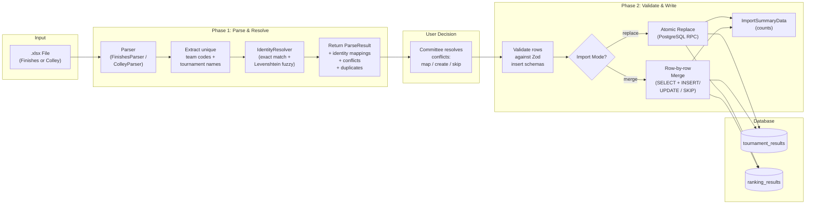
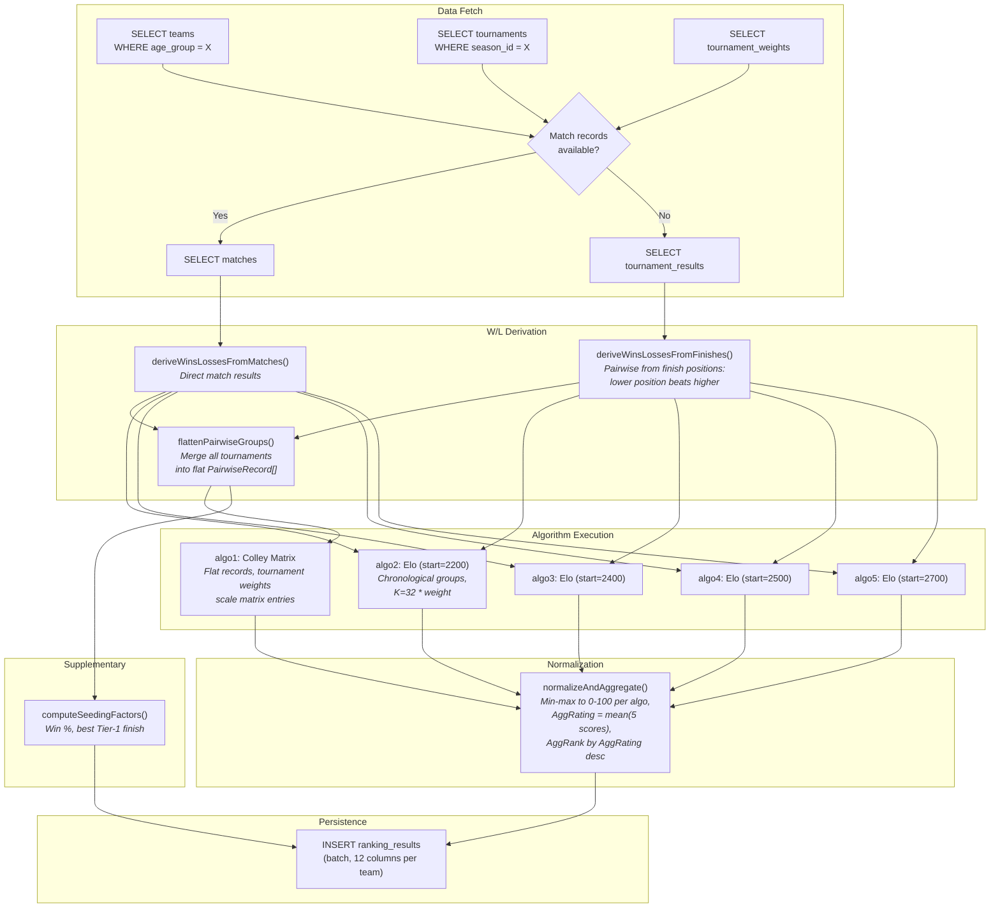
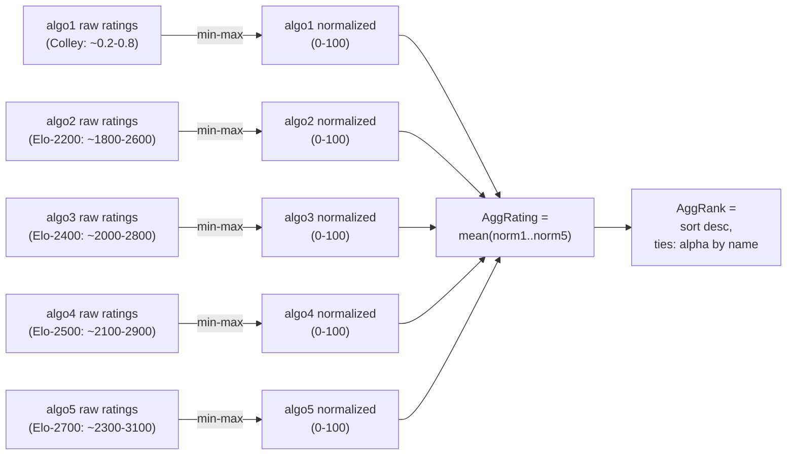
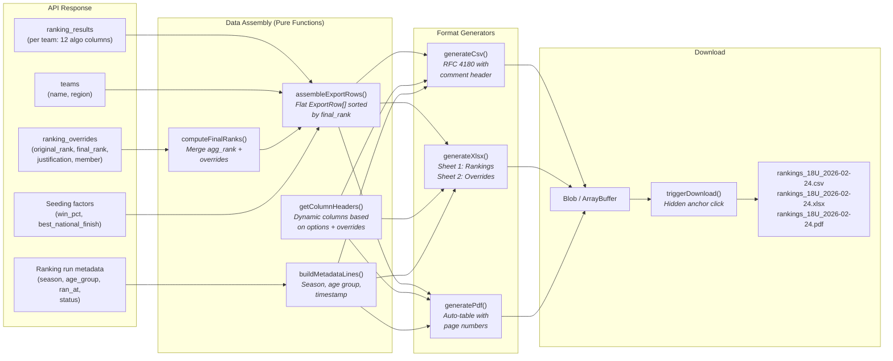

# Data Flow Diagrams

> Auto-generated by Autonomous Knowledge Synthesis
> Last updated: 2026-02-24

## Overview

This document traces three critical data flows through the Volleyball Ranking Engine: the import pipeline (data entry), the ranking computation (core processing), and the export pipeline (data output). Together, these three flows represent the complete lifecycle of tournament data through the system.

## 1. Import Pipeline Flow

Data enters the system as XLSX spreadsheets and flows through parsing, identity resolution, validation, and database insertion.

### Data Transformations

| Stage | Input | Output | Key Operation |
|-------|-------|--------|---------------|
| Parse | `ArrayBuffer` (XLSX binary) | `ParseResult<ParsedFinishesRow>` | Scan Row 1 merged cells for tournament names, detect Div/Fin/Tot triplets in Row 2, extract team+tournament data per row |
| Identity Resolve | `string[]` (team codes, tournament names) | `{matched: Map, unmatched: IdentityConflict[]}` | Case-insensitive exact match, then Levenshtein fuzzy match with >0.3 threshold |
| Validate | `ParsedFinishesRow[]` + `IdentityMapping[]` | `ValidatedRow[]` | Apply identity mappings (parsedValue -> UUID), validate against `tournamentResultInsertSchema` |
| Replace | `ValidatedRow[]` | `void` (database rows) | `import_replace_tournament_results` RPC: DELETE all for season+age_group, INSERT all new rows atomically |
| Merge | `ValidatedRow[]` | counts | Per-row: SELECT existing by composite key, INSERT if new, UPDATE if changed, SKIP if identical |

## 2. Ranking Computation Flow

Stored tournament data flows through the ranking pipeline, producing normalized results for five algorithms.

### Algorithm Data Requirements

| Algorithm | Input Structure | Key Difference |
|-----------|----------------|----------------|
| Colley Matrix | `PairwiseRecord[]` (flat, all tournaments merged) | All games weighted equally by time; tournament weights scale matrix entries |
| Elo (4 variants) | `TournamentPairwiseGroup[]` (grouped by tournament, sorted chronologically) | Processes tournaments in date order; later tournaments influence final rating more |

### Normalization Pipeline

## 3. Export Pipeline Flow

Ranking results flow from the API through data assembly and format-specific generators to downloadable files.

### Export Column Layout

The export includes a base set of columns plus optional algorithm breakdowns and override details:

| Column Group | Columns | Condition |
|-------------|---------|-----------|
| **Core** | Final Rank, Team, Region, Agg Rating, Agg Rank, Win %, Best National Finish | Always included |
| **Algorithm Breakdowns** | Algo 1-5 Rating, Algo 1-5 Rank (10 columns) | When `includeAlgorithmBreakdowns` is true |
| **Override Details** | Override Original Rank, Override Justification, Override Committee Member | When overrides exist for any team |

### Format-Specific Details

| Format | Library | Characteristics |
|--------|---------|----------------|
| CSV | None (pure string) | RFC 4180 compliant, metadata as `#` comment lines, override summary section appended |
| XLSX | `xlsx` (dynamic import) | Two worksheets: "Rankings" (metadata + data) and "Overrides" (summary, conditional) |
| PDF | `jspdf` + `jspdf-autotable` (dynamic import) | Landscape for detailed reports, portrait for summary. Header: title + metadata. Footer: page numbers. Override summary as second auto-table. |
