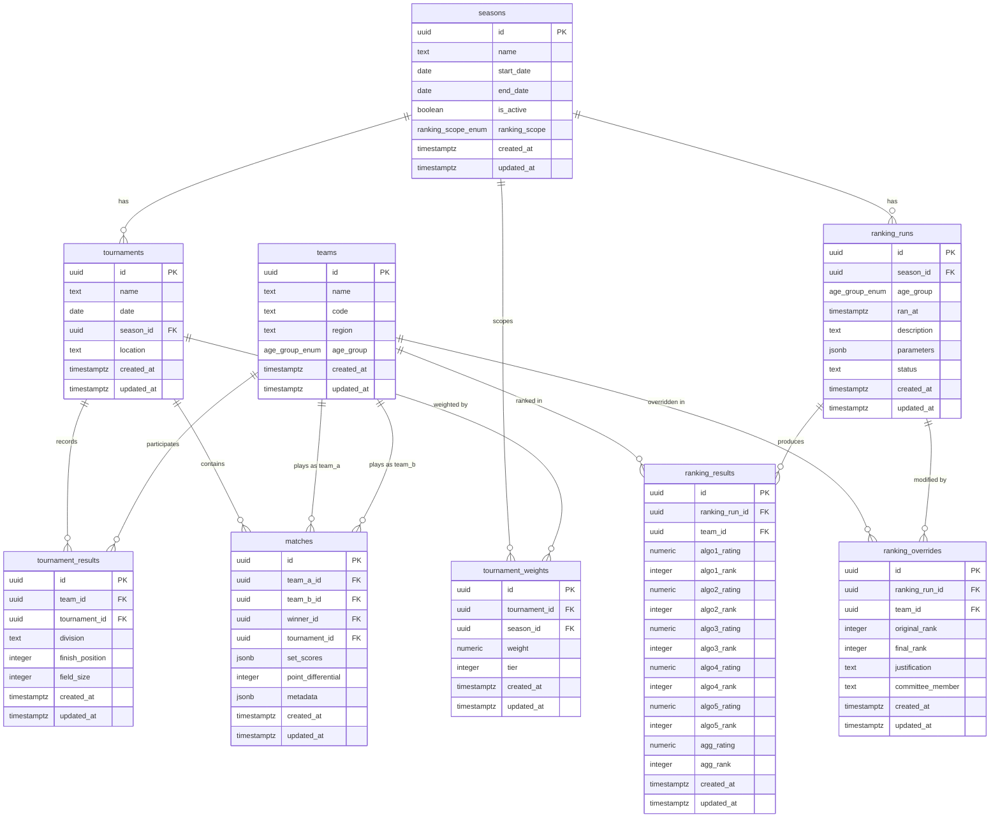

# Entity-Relationship Diagram

> Auto-generated by Autonomous Knowledge Synthesis
> Last updated: 2026-02-24

## Overview

The Volleyball Ranking Engine uses 9 PostgreSQL tables managed by 15 sequential migrations. The schema is organized around four conceptual domains: temporal context (seasons), competition data (tournaments, results, matches), team identity (teams), and ranking output (runs, results, overrides). All tables use UUID primary keys, automatic `created_at`/`updated_at` timestamps, and referential integrity constraints.

## Entity-Relationship Diagram

## Table Details

### seasons

Temporal grouping for tournaments and ranking runs. Each season has a date range and a configurable ranking scope (single-season or cross-season).

| Constraint | Type | Details |
|------------|------|---------|
| `id` | PRIMARY KEY | UUID, auto-generated |
| `ranking_scope` | CHECK (enum) | `'single_season'` or `'cross_season'` |

### teams

Team identity records. Unique by the combination of `code` and `age_group`.

| Constraint | Type | Details |
|------------|------|---------|
| `uq_teams_code_age_group` | UNIQUE | `(code, age_group)` -- prevents duplicate team codes within an age group |
| `age_group` | CHECK (enum) | `'15U'`, `'16U'`, `'17U'`, `'18U'` |

### tournaments

Individual tournament events belonging to a season.

| Constraint | Type | Details |
|------------|------|---------|
| `season_id` | FOREIGN KEY | References `seasons(id)` ON DELETE CASCADE |

### tournament_weights

Per-tournament, per-season importance weights and tier classifications. The committee configures these to amplify or diminish the influence of specific tournaments on ranking computations.

| Constraint | Type | Details |
|------------|------|---------|
| `uq_tournament_weights_tournament_season` | UNIQUE | `(tournament_id, season_id)` -- one weight per tournament per season |
| `tournament_id` | FOREIGN KEY | References `tournaments(id)` ON DELETE CASCADE |
| `season_id` | FOREIGN KEY | References `seasons(id)` ON DELETE CASCADE |

### tournament_results

One row per team per tournament entry. Records the division, finish position, and field size. This is the primary data source for the ranking pipeline when match records are not available.

| Constraint | Type | Details |
|------------|------|---------|
| `uq_tournament_results_team_tournament` | UNIQUE | `(team_id, tournament_id)` -- one result per team per tournament |
| `team_id` | FOREIGN KEY | References `teams(id)` ON DELETE RESTRICT |
| `tournament_id` | FOREIGN KEY | References `tournaments(id)` ON DELETE CASCADE |

### matches

Individual match records. This is the preferred data source for the ranking pipeline when available, because it provides direct head-to-head results rather than inferred pairwise records from finish positions.

| Constraint | Type | Details |
|------------|------|---------|
| `chk_matches_different_teams` | CHECK | `team_a_id != team_b_id` |
| `chk_matches_winner_is_participant` | CHECK | `winner_id IS NULL OR winner_id IN (team_a_id, team_b_id)` |
| `winner_id` | NULLABLE FK | NULL represents a draw (excluded from ranking calculations) |
| `set_scores`, `point_differential`, `metadata` | NULLABLE | Reserved for future enhancements |

### ranking_runs

Each run represents a single point-in-time computation of all five algorithms for one age group within one season.

| Constraint | Type | Details |
|------------|------|---------|
| `season_id` | FOREIGN KEY | References `seasons(id)` ON DELETE CASCADE |
| `age_group` | NOT NULL | Added by migration 15 |
| `status` | CHECK | `'draft'` or `'finalized'` (added by migration 13) |
| `parameters` | JSONB | Captures algorithm config at time of run (k_factor, elo_starting_ratings, weights) |
| `idx_ranking_runs_season_age_group` | INDEX | Composite index for efficient lookups |

### ranking_results

Per-team algorithm outputs tied to a ranking run snapshot. Stores individual algorithm ratings and ranks, plus the normalized aggregate.

| Constraint | Type | Details |
|------------|------|---------|
| `uq_ranking_results_run_team` | UNIQUE | `(ranking_run_id, team_id)` -- one result per team per run |
| `ranking_run_id` | FOREIGN KEY | References `ranking_runs(id)` ON DELETE CASCADE |
| `team_id` | FOREIGN KEY | References `teams(id)` ON DELETE RESTRICT |

**Algorithm column mapping:**

| Column Prefix | Algorithm |
|--------------|-----------|
| `algo1_` | Colley Matrix |
| `algo2_` | Elo (start=2200) |
| `algo3_` | Elo (start=2400) |
| `algo4_` | Elo (start=2500) |
| `algo5_` | Elo (start=2700) |
| `agg_` | Normalized aggregate (0--100 scale) |

### ranking_overrides

Committee manual adjustments to algorithmic rankings. Each override records the original algorithmic rank, the committee-assigned final rank, a mandatory justification, and the responsible committee member.

| Constraint | Type | Details |
|------------|------|---------|
| `uq_ranking_overrides_run_team` | UNIQUE | `(ranking_run_id, team_id)` -- one override per team per run |
| `justification` | CHECK | `char_length(justification) >= 10` -- enforces meaningful explanations |
| `committee_member` | CHECK | `char_length(committee_member) >= 2` -- enforces attribution |
| `ranking_run_id` | FOREIGN KEY | References `ranking_runs(id)` ON DELETE CASCADE |
| `team_id` | FOREIGN KEY | References `teams(id)` ON DELETE RESTRICT |

## Custom Types

| Type | Values | Used By |
|------|--------|---------|
| `age_group_enum` | `'15U'`, `'16U'`, `'17U'`, `'18U'` | `teams.age_group`, `ranking_runs.age_group` |
| `ranking_scope_enum` | `'single_season'`, `'cross_season'` | `seasons.ranking_scope` |

## RPC Functions

| Function | Purpose | Atomicity |
|----------|---------|-----------|
| `import_replace_tournament_results(p_season_id, p_age_group, p_rows)` | Delete all tournament results for a season+age_group, then insert new rows from JSONB array. | Single transaction (PostgreSQL function body) |
| `import_replace_ranking_results(p_ranking_run_id, p_rows)` | Delete all ranking results for a run, then insert new rows from JSONB array. | Single transaction |

## Migration History

| # | Migration | Description |
|---|-----------|-------------|
| 1 | `create_updated_at_trigger_function` | Shared `update_updated_at_column()` trigger function |
| 2 | `create_age_group_enum` | `age_group_enum` type |
| 3 | `create_ranking_scope_enum` | `ranking_scope_enum` type |
| 4 | `create_seasons_table` | `seasons` table |
| 5 | `create_teams_table` | `teams` table with `(code, age_group)` unique |
| 6 | `create_tournaments_table` | `tournaments` table |
| 7 | `create_tournament_weights_table` | `tournament_weights` table |
| 8 | `create_tournament_results_table` | `tournament_results` table |
| 9 | `create_matches_table` | `matches` table with CHECK constraints |
| 10 | `create_ranking_runs_table` | `ranking_runs` table |
| 11 | `create_ranking_results_table` | `ranking_results` table (algo1--algo5 + agg) |
| 12 | `create_import_replace_rpc` | Two RPC functions for atomic import |
| 13 | `add_ranking_run_status` | `status` column (`draft`/`finalized`) on `ranking_runs` |
| 14 | `create_ranking_overrides_table` | `ranking_overrides` table |
| 15 | `add_age_group_to_ranking_runs` | `age_group` column on `ranking_runs` |

## Delete Behavior

| Relationship | ON DELETE | Rationale |
|-------------|-----------|-----------|
| `tournaments.season_id` -> `seasons.id` | CASCADE | Deleting a season removes all its tournaments |
| `tournament_results.team_id` -> `teams.id` | RESTRICT | Prevent deleting a team that has tournament results |
| `tournament_results.tournament_id` -> `tournaments.id` | CASCADE | Deleting a tournament removes its results |
| `matches.team_a_id/team_b_id` -> `teams.id` | RESTRICT | Prevent deleting a team with match history |
| `matches.tournament_id` -> `tournaments.id` | CASCADE | Deleting a tournament removes its matches |
| `ranking_results.ranking_run_id` -> `ranking_runs.id` | CASCADE | Deleting a run removes its results |
| `ranking_results.team_id` -> `teams.id` | RESTRICT | Prevent deleting a ranked team |
| `ranking_overrides.ranking_run_id` -> `ranking_runs.id` | CASCADE | Deleting a run removes its overrides |
| `ranking_overrides.team_id` -> `teams.id` | RESTRICT | Prevent deleting a team with overrides |
