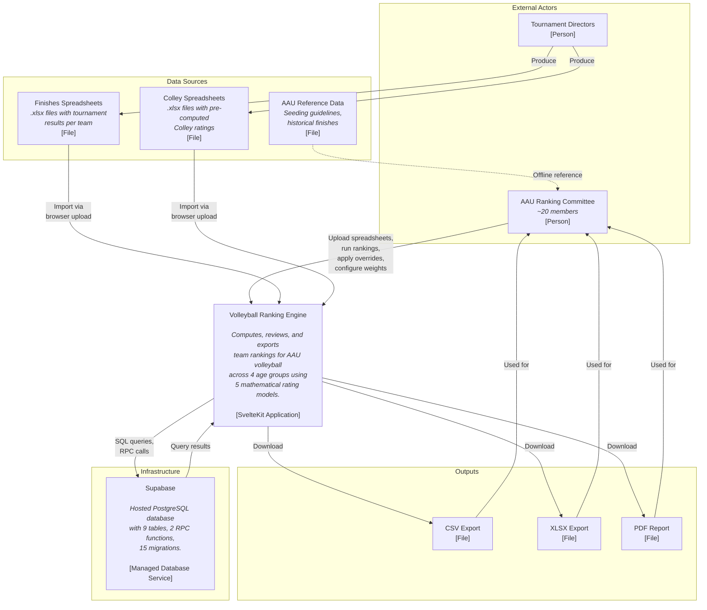

# System Context Diagram (C4 Level 1)

> Auto-generated by Autonomous Knowledge Synthesis
> Last updated: 2026-02-24

## Overview

The system context diagram shows the Volleyball Ranking Engine as a single system box, identifying the external actors that interact with it and the infrastructure services it depends on. This is the highest-level view of the system boundary.

## Diagram

## Actor Descriptions

| Actor | Role | Interaction Pattern |
|-------|------|-------------------|
| **AAU Ranking Committee** | Primary users who import data, run ranking computations, review results, apply overrides, configure tournament weights, and export final rankings. | Browser-based interaction via the SvelteKit application. |
| **Tournament Directors** | Produce the XLSX spreadsheets containing tournament results. They do not interact with the system directly. | Offline: create spreadsheets that committee members upload. |

## System Boundary

The Volleyball Ranking Engine is a self-contained SvelteKit application. It does not call external APIs, does not receive webhooks, and does not publish events. All data enters through XLSX file uploads and all data exits through browser-downloaded export files (CSV, XLSX, PDF).

The sole infrastructure dependency is Supabase (PostgreSQL), which provides:
- 9 relational tables (`seasons`, `teams`, `tournaments`, `tournament_weights`, `tournament_results`, `matches`, `ranking_runs`, `ranking_results`, `ranking_overrides`).
- 2 RPC functions for atomic import operations (`import_replace_tournament_results`, `import_replace_ranking_results`).
- 2 custom enums (`age_group_enum`, `ranking_scope_enum`).
- Auto-generated TypeScript types for compile-time type safety.
