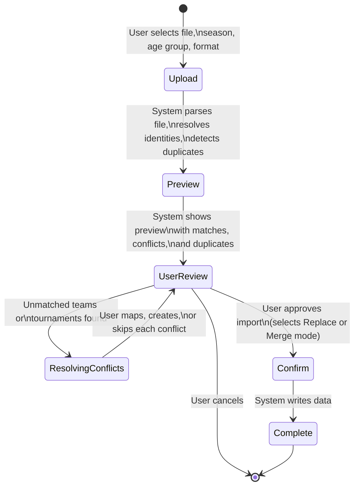

# Data Import Business Rules

> Last updated: 2026-02-24

This document describes how tournament results and pre-computed ranking data are imported into the system from Excel spreadsheets. It covers the two import formats, the two-phase import workflow, identity resolution, duplicate detection, and all validation rules.

---

## Table of Contents

- [Overview](#overview)
- [Two-Phase Import Workflow](#two-phase-import-workflow)
- [Import Format: Finishes](#import-format-finishes)
- [Import Format: Colley](#import-format-colley)
- [Identity Resolution](#identity-resolution)
- [Duplicate Detection](#duplicate-detection)
- [Import Modes](#import-modes)
- [Validation Rules](#validation-rules)
- [Error Conditions and System Responses](#error-conditions-and-system-responses)

---

## Overview

The system accepts data through Excel spreadsheet uploads (.xlsx files). There are two distinct import formats, each serving a different purpose:

| Format | Purpose | What It Contains |
|--------|---------|-----------------|
| **Finishes** | Import tournament placement data | Team names, tournament names, division, finish position, field size |
| **Colley** | Import pre-computed ranking results | Team names, win/loss records, algorithm ratings and ranks |

Every import follows a two-phase process: first the system previews what will happen, then the user confirms the import.

---

## Two-Phase Import Workflow

Data import is deliberately split into two steps to prevent accidental data corruption.

### Phase 1: Upload and Preview

When a user uploads a spreadsheet, the system performs the following steps before any data is written:

1. **File validation** -- Checks that the file is a valid .xlsx file within size limits.
2. **Parsing** -- Reads the spreadsheet and extracts structured data rows.
3. **Identity resolution** -- Matches team names and tournament names from the spreadsheet against existing records in the system.
4. **Duplicate detection** -- Identifies rows that would conflict with data already in the system.
5. **Preview generation** -- Returns a summary showing what was found, what matched, what did not match, and what conflicts exist.

No data is saved during Phase 1. The user reviews the preview and resolves any issues.

### Phase 2: Confirm and Execute

When the user is satisfied with the preview and has resolved all identity conflicts, they confirm the import. At this point:

1. **New records creation** -- Any teams or tournaments the user chose to create (for unmatched names) are added to the system.
2. **Row validation** -- Each data row is validated against the system's data rules.
3. **Data writing** -- Valid rows are written to the system in the selected import mode (Replace or Merge).
4. **Summary** -- The system reports how many rows were inserted, updated, or skipped.

### Rules

- **RULE I-FLOW-01:** When a file is uploaded, the system never writes data during the preview phase. All changes happen only after the user explicitly confirms.
- **RULE I-FLOW-02:** When the user cancels after preview, no data is changed.

---

## Import Format: Finishes

The Finishes format is used to import tournament placement data from a structured Excel spreadsheet.

### Expected Spreadsheet Layout

The Finishes spreadsheet has a specific structure:

| Section | Location | Content |
|---------|----------|---------|
| **Tournament names** | Row 1 | Tournament names in merged cells spanning three columns each |
| **Column sub-headers** | Row 2 | Repeating pattern of "Div", "Fin", "Tot" under each tournament |
| **Team data** | Rows 3 and below | Team name in column A, team code in column B, then tournament data |

The first 10 columns contain team-level information. Tournament data begins at column 11 (the 11th column), with each tournament occupying three columns:

| Column | Meaning | Example |
|--------|---------|---------|
| **Div** | The division the team competed in | "Open", "Gold", "Silver" |
| **Fin** | The team's finish position (must be a whole number) | 1, 2, 3, 15 |
| **Tot** | The total number of teams in that division (field size, must be a whole number) | 16, 24, 32 |

The last 5 columns of the spreadsheet are summary columns and are ignored by the system.

### Rules

- **RULE I-FIN-01:** When a row has both the Finish (Fin) and Total (Tot) columns empty for a tournament, the system interprets this as the team not having attended that tournament. No record is created for that team-tournament combination.
- **RULE I-FIN-02:** When the Finish column contains a non-integer value (e.g., "3rd", "DNF", 2.5), the system flags an error for that cell and skips that tournament entry for the team.
- **RULE I-FIN-03:** When the Total column contains a non-integer value, the system flags an error for that cell.
- **RULE I-FIN-04:** When a row has a team name but no team code (or vice versa), the entire row is flagged as an error and skipped.
- **RULE I-FIN-05:** Completely empty rows (no team name and no team code) are silently skipped.
- **RULE I-FIN-06:** The system automatically detects tournament column groups by looking for the "Div/Fin/Tot" pattern in Row 2. It adapts to spreadsheets with different numbers of tournaments or padding columns between tournaments.

> **Example of valid Finishes spreadsheet structure:**
>
> | (Row 1) | | | ... | Sunshine Invitational | | | Midtown Classic | | |
> |---------|---|---|-----|----------------------|---|---|-----------------|---|---|
> | (Row 2) | Team | Code | ... | Div | Fin | Tot | Div | Fin | Tot |
> | (Row 3) | Thunder VBC | THU | ... | Open | 3 | 16 | Gold | 1 | 12 |
> | (Row 4) | Lightning VBC | LGT | ... | Open | 7 | 16 | | | |
>
> In this example, Lightning VBC did not attend the Midtown Classic (empty Fin/Tot), so no record is created for that combination.

---

## Import Format: Colley

The Colley format is used to import pre-computed ranking results directly. This is useful when rankings have been calculated externally and need to be loaded into the system.

### Expected Spreadsheet Layout

The Colley spreadsheet uses a fixed 16-column layout:

| Column | Content | Required? |
|--------|---------|-----------|
| A | Team Name | Yes |
| B | Team Code | Yes |
| C | Wins | Yes (must be a number) |
| D | Losses | Yes (must be a number) |
| E | Algorithm 1 Rating | No |
| F | Algorithm 1 Rank | No |
| G | Algorithm 2 Rating | No |
| H | Algorithm 2 Rank | No |
| I | Algorithm 3 Rating | No |
| J | Algorithm 3 Rank | No |
| K | Algorithm 4 Rating | No |
| L | Algorithm 4 Rank | No |
| M | Algorithm 5 Rating | No |
| N | Algorithm 5 Rank | No |
| O | Aggregate Rating | No |
| P | Aggregate Rank | No |

Row 1 is the header row and is skipped. Data begins at Row 2.

### Rules

- **RULE I-COL-01:** Team Name and Team Code are always required. A row missing either one is flagged as an error and skipped.
- **RULE I-COL-02:** Wins and Losses are required and must be numeric. A row with missing or non-numeric values in these columns is flagged as an error and skipped.
- **RULE I-COL-03:** All rating and rank columns are optional. When left empty, they are stored as blank (not zero).
- **RULE I-COL-04:** When a rating column contains a non-numeric value, the system flags it as an error.
- **RULE I-COL-05:** When a rank column contains a non-integer value, the system flags a warning (but still processes the row if possible).
- **RULE I-COL-06:** When a Colley import is confirmed, the system automatically creates a new ranking run to hold the imported results.

---

## Identity Resolution

Team names and tournament names in spreadsheets often do not exactly match what is already in the system. The identity resolution process matches imported names to existing records.

### How Matching Works

1. **Exact match (case-insensitive):** The system first attempts to match each imported team code or tournament name against existing records, ignoring upper/lower case differences.
   - Example: "thu" in the spreadsheet matches "THU" in the system.

2. **Fuzzy match suggestions:** When no exact match is found, the system suggests up to three possible matches based on how similar the names are.
   - Example: "Thundre VBC" (misspelled) might match "Thunder VBC" with a high similarity score.
   - Only suggestions with a similarity score above 30% are shown.

3. **User resolution:** For each unmatched name, the user must choose one of three actions:

| Action | What Happens |
|--------|-------------|
| **Map** | Link the imported name to an existing team or tournament the user selects from the suggestions |
| **Create** | Create a new team or tournament record with the imported name |
| **Skip** | Ignore all rows associated with this unmatched name |

### Rules

- **RULE I-IDENT-01:** When a team code from the spreadsheet exactly matches (ignoring case) an existing team code in the same age group, the system automatically maps them.
- **RULE I-IDENT-02:** When a tournament name from the spreadsheet exactly matches (ignoring case) an existing tournament name in the same season, the system automatically maps them.
- **RULE I-IDENT-03:** When no exact match is found, the system calculates a similarity score comparing the imported name against every existing record. Only matches scoring above 30% similarity are presented as suggestions.
- **RULE I-IDENT-04:** The similarity calculation compares the imported value against both the team code and the team name. The highest score of the two is used.
- **RULE I-IDENT-05:** When the user selects "Skip" for a team, all rows involving that team are excluded from the import.
- **RULE I-IDENT-06:** When the user selects "Skip" for a tournament, all rows involving that tournament are excluded from the import.
- **RULE I-IDENT-07:** When the user selects "Create" for a team, the system creates the new team record before importing data rows.
- **RULE I-IDENT-08:** When the user selects "Create" for a tournament, the system creates the new tournament record before importing data rows.
- **RULE I-IDENT-09:** Team identity resolution is scoped to the selected age group. A team code "THU" in 16U is a different record from "THU" in 17U.
- **RULE I-IDENT-10:** Tournament identity resolution is scoped to the selected season.

> **Example:**
>
> A spreadsheet contains the team code "STHRN". The system finds no exact match in the 16U age group, but suggests:
> - "SOUTHERN" (Southern VBC) -- 72% similarity
> - "STRM" (Storm VBC) -- 45% similarity
>
> The user recognizes this is Southern VBC and selects "Map" to link "STHRN" to the existing Southern VBC record.

---

## Duplicate Detection

Before confirming an import, the system checks whether the incoming data would create duplicate records.

### For Finishes Imports

- **RULE I-DUP-01:** A duplicate is detected when a record already exists for the same team at the same tournament. The system reports which team-tournament combinations already have data.

### For Colley Imports

- **RULE I-DUP-02:** A duplicate is detected when ranking results already exist for the same team in the same ranking run.

### How Duplicates Are Handled

Duplicate handling depends on the selected import mode (see next section). The system always informs the user about duplicates during the preview phase so they can make an informed choice.

---

## Import Modes

When confirming an import, the user selects one of two modes that control how existing data is handled:

### Replace Mode

- **RULE I-MODE-01:** In Replace mode, the system deletes all existing records for the selected scope (season + age group for Finishes; ranking run for Colley) and inserts all valid imported rows as fresh data.
- **RULE I-MODE-02:** The deletion and insertion happen as a single operation. If the insertion fails, the deletion is also rolled back (no data is lost).
- **RULE I-MODE-03:** In Replace mode, the summary reports the number of rows inserted and the number of rows skipped (due to validation errors or identity resolution "Skip" actions).

### Merge Mode

- **RULE I-MODE-04:** In Merge mode, the system processes each row individually:
  - When no matching record exists: the row is inserted as new data.
  - When a matching record exists and the data has changed: the existing record is updated with the new values.
  - When a matching record exists and the data is identical: the row is skipped (no changes made).
- **RULE I-MODE-05:** For Finishes, a "matching record" is identified by the combination of team and tournament.
- **RULE I-MODE-06:** For Colley, a "matching record" is identified by the combination of team and ranking run.
- **RULE I-MODE-07:** In Merge mode, the summary reports separate counts for rows inserted, rows updated, and rows skipped.

---

## Validation Rules

### File-Level Validation

| Rule | Condition | System Response |
|------|-----------|----------------|
| **RULE I-VAL-01** | File is not .xlsx format | Rejected with message: "Only .xlsx files are accepted" |
| **RULE I-VAL-02** | File size exceeds 10 MB | Rejected with message: "File size exceeds the 10 MB limit" |
| **RULE I-VAL-03** | Spreadsheet is empty (no data sheet or no data range) | Returns empty result with zero rows parsed |
| **RULE I-VAL-04** | Age group is not one of 15U, 16U, 17U, 18U | Rejected with message listing valid age groups |
| **RULE I-VAL-05** | Format is not "finishes" or "colley" | Rejected with message listing valid formats |

### Row-Level Validation

| Rule | Condition | System Response |
|------|-----------|----------------|
| **RULE I-VAL-06** | Row is completely empty | Silently skipped (no error) |
| **RULE I-VAL-07** | Team name is present but team code is missing | Error flagged for that row |
| **RULE I-VAL-08** | Team code is present but team name is missing | Error flagged for that row |
| **RULE I-VAL-09** | Required numeric field contains text | Error flagged for that cell |
| **RULE I-VAL-10** | Rank field contains a non-whole-number (e.g., 3.5) | Warning flagged (Colley format only) |

### Confirmation-Phase Validation

| Rule | Condition | System Response |
|------|-----------|----------------|
| **RULE I-VAL-11** | Identity mapping missing for a team (not mapped, created, or skipped) | Error: "No mapping found for team code: [code]" |
| **RULE I-VAL-12** | Identity mapping missing for a tournament (Finishes only) | Error: "No mapping found for tournament: [name]" |
| **RULE I-VAL-13** | Any row fails schema validation after identity resolution | Import is blocked; first 5 errors are shown |

---

## Error Conditions and System Responses

| Scenario | What the User Sees |
|----------|-------------------|
| Upload a .csv file instead of .xlsx | "Only .xlsx files are accepted" |
| Upload a 15 MB file | "File size exceeds the 10 MB limit" |
| Select age group "14U" | "Invalid age_group. Must be one of: 15U, 16U, 17U, 18U" |
| Spreadsheet has "DNF" in a Finish column | Error on that cell: "Non-integer value in Fin column: DNF" |
| Team code "XYZ" not found in the system | Identity conflict with up to 3 fuzzy match suggestions |
| User confirms with unresolved identity conflicts | Error listing which teams or tournaments have no mapping |
| Merge mode and existing data is identical | Row is skipped, reported in summary as "skipped" |
| Replace mode and database write fails | All changes are rolled back; the original data is preserved |
| Colley spreadsheet missing Wins column for a row | Error: "Missing required value for Wins" |
