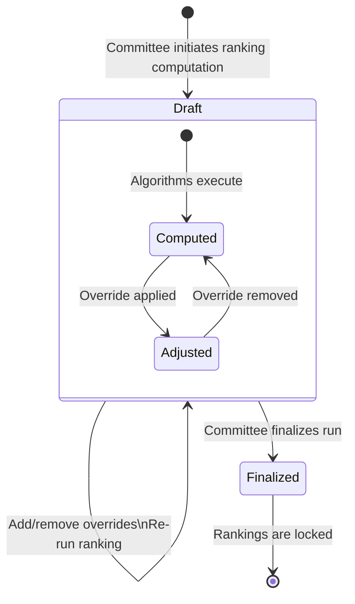
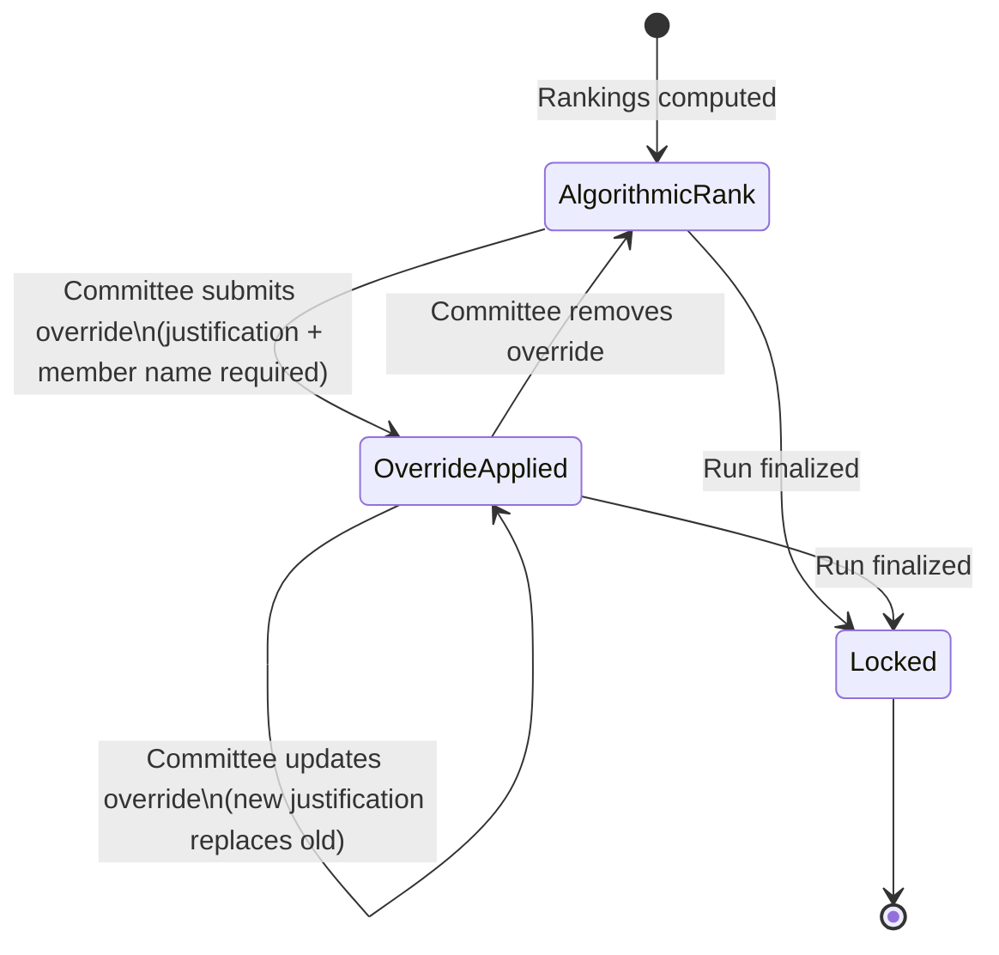

# Ranking System Business Rules

> Last updated: 2026-02-24

This document describes how team rankings are computed, how tournament importance is factored in, how ties are broken, how committee overrides work, and how a ranking run is finalized.

---

## Table of Contents

- [Overview](#overview)
- [Ranking Run Lifecycle](#ranking-run-lifecycle)
- [Data Sources](#data-sources)
- [How Win/Loss Records Are Derived](#how-winloss-records-are-derived)
- [The Five Ranking Algorithms](#the-five-ranking-algorithms)
- [Normalization and Aggregation](#normalization-and-aggregation)
- [Tournament Weights](#tournament-weights)
- [Tie-Breaking Rules](#tie-breaking-rules)
- [Seeding Reference Factors](#seeding-reference-factors)
- [Committee Override Workflow](#committee-override-workflow)
- [Finalization Rules](#finalization-rules)
- [Error Handling and Cleanup](#error-handling-and-cleanup)
- [Worked Example](#worked-example)

---

## Overview

Each ranking run produces a complete ranking of all teams in a single age group (15U, 16U, 17U, or 18U) for a single season. The system runs five independent ranking algorithms, scales each algorithm's output to a common 0-100 point scale, averages the five scores, and assigns a final rank based on that average.

---

## Ranking Run Lifecycle

A ranking run passes through two states. Once finalized, it cannot be modified.

| State | What Can Happen | What Cannot Happen |
|-------|-----------------|-------------------|
| **Draft** | View results, add overrides, remove overrides, export, re-run | -- |
| **Finalized** | View results, export | Add overrides, remove overrides, re-run, delete |

### Rules

- **RULE R-LIFE-01:** When a ranking run is created, it starts in Draft status.
- **RULE R-LIFE-02:** When a committee member requests finalization and the run is in Draft status, the system locks the run as Finalized.
- **RULE R-LIFE-03:** When a committee member attempts to finalize a run that is already Finalized, the system rejects the request and reports that the run is already finalized.
- **RULE R-LIFE-04:** When any modification (override add, override remove) is attempted on a Finalized run, the system rejects the request.

---

## Data Sources

The system can draw on two types of source data, and it automatically selects the best available source.

| Data Source | Description | When Used |
|-------------|-------------|-----------|
| **Match Records** | Individual game results showing which two teams played and who won | Preferred when available |
| **Tournament Finishes** | Placement data showing each team's finish position at a tournament | Used when match records are not available |

### Rules

- **RULE R-DATA-01:** When match records exist for the season's tournaments, the system uses match records as the data source.
- **RULE R-DATA-02:** When no match records exist, the system uses tournament finish positions as the data source.
- **RULE R-DATA-03:** Only teams belonging to the selected age group are included. Results involving teams from other age groups are excluded.

---

## How Win/Loss Records Are Derived

Before the ranking algorithms can run, the system needs to know which teams beat which other teams. The derivation method depends on the data source.

### From Tournament Finishes

When using finish positions, the system generates win/loss records by comparing every pair of teams that competed in the same tournament and division.

- **RULE R-DERIVE-01:** When Team A finished in a higher position (lower number) than Team B at the same tournament in the same division, the system records Team A as having beaten Team B.
- **RULE R-DERIVE-02:** When two teams finished in the same position, no win/loss record is generated between them (the result is treated as inconclusive).
- **RULE R-DERIVE-03:** Tournament results are grouped by tournament and division. A team's finish in Division Gold does not create matchups against teams in Division Silver.

> **Example:** At the Sunshine Invitational, Open Division:
> - Team Alpha finished 1st
> - Team Beta finished 2nd
> - Team Gamma finished 3rd
> - Team Delta finished 3rd (tied)
>
> Derived records:
> - Alpha beat Beta, Alpha beat Gamma, Alpha beat Delta
> - Beta beat Gamma, Beta beat Delta
> - No record between Gamma and Delta (tied finish)

### From Match Records

When using actual game results, the conversion is more straightforward.

- **RULE R-DERIVE-04:** When a match has a winner, the system records one win for the winning team and one loss for the losing team.
- **RULE R-DERIVE-05:** When a match is a draw (no winner), the system ignores that match entirely.

### Chronological Ordering

- **RULE R-DERIVE-06:** All win/loss records are organized by tournament date, from earliest to latest. This ordering matters for the Elo algorithms, which process results sequentially.

---

## The Five Ranking Algorithms

### Algorithm 1: Colley Matrix

The Colley Matrix is a mathematical method that evaluates every team's complete season of results simultaneously. It does not care about the order in which games were played.

**How it works in plain language:**
- Every team starts with a baseline rating of 0.5 (on a scale roughly centered around 0.5).
- Each win nudges a team's rating upward; each loss nudges it downward.
- The amount a rating changes depends on who the opponent was and how many games each team played.
- The system solves for the set of ratings where everything is internally consistent -- a team that beats many highly-rated opponents ends up with a higher rating than a team with the same record against weaker opponents.

**Key Properties:**
- Order of games does not matter (a win in January is weighted the same as a win in March).
- Strength of schedule is inherently accounted for.
- All teams' ratings are determined simultaneously.

### Algorithms 2-5: Elo Rating Variants

The Elo system is a sequential rating method. It processes tournaments in date order and updates team ratings after each matchup.

**How it works in plain language:**
- Every team starts the season with an initial rating.
- Before each matchup, the system predicts who is expected to win based on current ratings.
- When the expected team wins, ratings change by a small amount. When an upset occurs, ratings change by a larger amount.
- A sensitivity factor (called the K-factor, defaulting to 32) controls how much ratings swing after each result.

The system runs four Elo variants, each starting at a different initial rating:

| Algorithm | Label | Starting Rating |
|-----------|-------|-----------------|
| Algorithm 2 | Elo Variant A | 2,200 |
| Algorithm 3 | Elo Variant B | 2,400 |
| Algorithm 4 | Elo Variant C | 2,500 |
| Algorithm 5 | Elo Variant D | 2,700 |

**Why four variants?**
Using different starting points tests whether the final rankings are sensitive to the initial assumption. If a team is truly the best, it should rank highly regardless of whether all teams started at 2,200 or 2,700. Averaging across four starting points reduces the influence of this arbitrary choice.

### Rules for All Algorithms

- **RULE R-ALGO-01:** When there are no teams in the selected age group, the system reports an error and does not produce rankings.
- **RULE R-ALGO-02:** When there is exactly one team, that team receives a rank of 1 in all algorithms.
- **RULE R-ALGO-03:** Each algorithm independently produces a rating (a number) and a rank (a position) for every team.

---

## Normalization and Aggregation

Because the five algorithms produce ratings on completely different scales (Colley produces numbers near 0.5; Elo produces numbers near 2,200-2,700), the system must normalize them before combining.

### Normalization Process

Each algorithm's ratings are rescaled to a 0-to-100 point scale:

- The team with the highest raw rating in an algorithm receives a normalized score of **100**.
- The team with the lowest raw rating in an algorithm receives a normalized score of **0**.
- All other teams are proportionally placed between 0 and 100.

### Rules

- **RULE R-NORM-01:** When all teams in an algorithm have the same raw rating, every team receives a normalized score of 50.
- **RULE R-NORM-02:** The aggregate rating (AggRating) is the simple average of a team's five normalized scores, rounded to two decimal places.
- **RULE R-NORM-03:** The aggregate rank (AggRank) is assigned by sorting all teams by AggRating from highest to lowest, with ties broken alphabetically by team name.

> **Example:**
>
> Team Phoenix has the following normalized scores across the five algorithms:
> - Colley: 82.5
> - Elo A: 78.3
> - Elo B: 80.1
> - Elo C: 79.6
> - Elo D: 81.0
>
> AggRating = (82.5 + 78.3 + 80.1 + 79.6 + 81.0) / 5 = **80.30**

---

## Tournament Weights

Not all tournaments are created equal. The committee assigns a weight to each tournament, which amplifies or diminishes that tournament's influence on rankings.

### How Weights Work

| Weight Value | Effect |
|-------------|--------|
| **1.0** (default) | Standard influence -- the tournament counts normally |
| **Greater than 1.0** (e.g., 2.0, 3.0) | Increased influence -- results from this tournament count more heavily |
| **Less than 1.0** (e.g., 0.5) | Reduced influence -- results from this tournament count less |
| **0.0** | The tournament is effectively ignored in ranking calculations |

**Valid range:** 0.0 through 5.0 (positive numbers only for non-zero weights).

### Tournament Tiers

Each tournament is also assigned a tier number, where lower numbers indicate more prestigious events:

| Tier | Meaning |
|------|---------|
| **Tier 1** | National-level or premier tournaments |
| **Tier 2-4** | Regionally significant events |
| **Tier 5** (default) | Standard tournaments |

Tier information is used for seeding reference data (see below) but does not directly change rankings. The weight value is what controls ranking influence.

### Rules

- **RULE R-WEIGHT-01:** When no custom weight is assigned to a tournament, a default weight of 1.0 and default tier of 5 are used.
- **RULE R-WEIGHT-02:** Tournament weights apply equally to all five algorithms.
- **RULE R-WEIGHT-03:** For the Colley algorithm, the weight multiplies the influence of each win/loss pair from that tournament.
- **RULE R-WEIGHT-04:** For the Elo algorithms, the weight multiplies the sensitivity factor (K-factor), causing larger or smaller rating changes for results at that tournament.
- **RULE R-WEIGHT-05:** The tournament weights used in a ranking run are recorded as part of the run's parameters so the exact computation can be reviewed later.

> **Example:**
>
> The AAU National Championship has a weight of 3.0. A regular-season local event has the default weight of 1.0.
>
> If Team Ace beats Team Bold at Nationals, that win is three times as influential on rankings as the same result at a local event.

---

## Tie-Breaking Rules

Ties can occur at two levels: within a single algorithm, and in the aggregate rating.

### Rules

- **RULE R-TIE-01:** Within each algorithm, when two teams have the exact same rating, the team whose name comes first alphabetically receives the higher rank (lower number).
- **RULE R-TIE-02:** In the aggregate ranking, when two teams have the exact same AggRating (after rounding to two decimal places), the team whose name comes first alphabetically receives the higher rank.

> **Example:**
>
> After all algorithms are averaged:
> - "Central Valley VBC" has AggRating 72.45
> - "Coastal Elite VBC" has AggRating 72.45
>
> "Central Valley VBC" is ranked higher because "Central" comes before "Coastal" alphabetically.

---

## Seeding Reference Factors

In addition to the algorithmic rankings, the system computes supplementary data that the committee can reference during seeding discussions. These factors are **not** part of the ranking calculation.

### Win Percentage

- **RULE R-SEED-01:** Win percentage is calculated as: (total wins / total games played), displayed as a percentage to one decimal place (e.g., 75.0%).
- **RULE R-SEED-02:** When a team has played zero games, their win percentage is 0%.

### Best National Finish

- **RULE R-SEED-03:** The system identifies each team's best (lowest) finish position at any Tier-1 tournament during the season.
- **RULE R-SEED-04:** When a team did not compete in any Tier-1 tournaments, their best national finish is reported as "N/A."
- **RULE R-SEED-05:** The name of the Tier-1 tournament where the best finish occurred is included for reference.

> **Example:**
>
> Team Thunderbolts competed in two Tier-1 events:
> - AAU Nationals: finished 5th
> - USAV Junior Championships: finished 3rd
>
> Best National Finish: 3rd (at USAV Junior Championships)

---

## Committee Override Workflow

After rankings are algorithmically computed, the committee may adjust individual team positions.

### Override Requirements

Each override must include:

| Required Information | Minimum Length | Purpose |
|---------------------|---------------|---------|
| Ranking Run | -- | Identifies which ranking run to modify |
| Team | -- | Identifies which team to move |
| Original Rank | -- | The team's algorithmically computed rank (recorded automatically) |
| New Rank | -- | The desired final rank position |
| Justification | 10 characters | A written explanation of why the change was made |
| Committee Member Name | 2 characters | The name of the person authorizing the change |

### Rules

- **RULE R-OVER-01:** When an override is applied to a team, the team's final rank changes to the specified position. The original algorithmic rank is preserved in the override record.
- **RULE R-OVER-02:** When an override already exists for a team in a ranking run and a new override is submitted, the existing override is replaced with the new values.
- **RULE R-OVER-03:** When an override is removed, the team reverts to its original algorithmic rank.
- **RULE R-OVER-04:** Overrides can only be added, modified, or removed while the ranking run is in Draft status.
- **RULE R-OVER-05:** When the ranking run is Finalized, any attempt to add, modify, or remove an override is rejected.
- **RULE R-OVER-06:** The final published rank for any team is determined by: if an override exists, use the override's final rank; otherwise, use the algorithmic aggregate rank.

### Override Workflow Diagram

> **Example:**
>
> After computation, Team Dynamo is ranked 12th by the algorithms. The committee determines that Team Dynamo should be ranked 8th due to a scheduling conflict that prevented them from attending a key tournament. A committee member enters:
> - Original Rank: 12
> - New Rank: 8
> - Justification: "Team missed Southeast Regional due to facility closure; head-to-head record against teams ranked 8-11 is 6-1"
> - Committee Member: "Jane Roberts"
>
> Team Dynamo now appears at rank 8 in all exports and displays, with the override clearly noted.

---

## Finalization Rules

Finalization locks a ranking run permanently.

- **RULE R-FINAL-01:** When the committee finalizes a draft run, its status changes to Finalized.
- **RULE R-FINAL-02:** A finalized run cannot be returned to Draft status. This is a one-way operation.
- **RULE R-FINAL-03:** After finalization, the rankings, overrides, algorithm scores, and all parameters are preserved exactly as they were at the moment of finalization.
- **RULE R-FINAL-04:** Exports from a finalized run display the status as "Finalized." Exports from a draft run display the status as "Draft."

---

## Error Handling and Cleanup

- **RULE R-ERR-01:** When the ranking computation fails at any step (data retrieval, algorithm execution, or results storage), the system automatically cleans up by removing the incomplete ranking run and any partial results. No incomplete data is left behind.
- **RULE R-ERR-02:** When the selected season does not exist, the system reports a clear error before any computation begins.
- **RULE R-ERR-03:** When the selected age group is not one of the four valid values (15U, 16U, 17U, 18U), the system rejects the request immediately.

---

## Worked Example

Here is a complete walkthrough showing how rankings are produced for a small set of teams.

### Setup

**Season:** 2025-2026
**Age Group:** 16U
**Teams:** Alpha VBC, Bravo VBC, Charlie VBC, Delta VBC

**Tournaments and Weights:**

| Tournament | Date | Weight | Tier |
|-----------|------|--------|------|
| Fall Classic | 2025-10-15 | 1.0 | 5 |
| Winter Showcase | 2026-01-10 | 1.5 | 3 |
| AAU Nationals | 2026-03-05 | 3.0 | 1 |

**Tournament Finishes (all Open Division):**

| Team | Fall Classic | Winter Showcase | AAU Nationals |
|------|-------------|-----------------|---------------|
| Alpha VBC | 1st | 2nd | 1st |
| Bravo VBC | 2nd | 1st | 3rd |
| Charlie VBC | 3rd | 3rd | 2nd |
| Delta VBC | 4th | 4th | 4th |

### Step 1: Derive Win/Loss Records

From these finishes, the system generates pairwise win/loss records. For example, at the Fall Classic:
- Alpha beat Bravo, Charlie, Delta (3 wins)
- Bravo beat Charlie, Delta (2 wins)
- Charlie beat Delta (1 win)
- Delta: 0 wins

This is repeated for each tournament, with the Winter Showcase records weighted at 1.5x and Nationals records weighted at 3.0x.

### Step 2: Run Five Algorithms

Each algorithm produces its own rating and rank. For illustration:

| Team | Colley Rating | Colley Rank | Elo-A Rank | Elo-B Rank | Elo-C Rank | Elo-D Rank |
|------|--------------|-------------|------------|------------|------------|------------|
| Alpha VBC | 0.72 | 1 | 1 | 1 | 1 | 1 |
| Bravo VBC | 0.55 | 2 | 2 | 3 | 2 | 2 |
| Charlie VBC | 0.48 | 3 | 3 | 2 | 3 | 3 |
| Delta VBC | 0.25 | 4 | 4 | 4 | 4 | 4 |

### Step 3: Normalize to 0-100 Scale

Each algorithm's ratings are scaled so the best team gets 100 and the worst gets 0.

### Step 4: Average the Five Normalized Scores

| Team | Avg Score | AggRank |
|------|-----------|---------|
| Alpha VBC | 95.2 | 1 |
| Bravo VBC | 62.8 | 2 |
| Charlie VBC | 55.4 | 3 |
| Delta VBC | 8.1 | 4 |

### Step 5: Seeding Factors (Reference Only)

| Team | Win % | Best National Finish |
|------|-------|---------------------|
| Alpha VBC | 91.7% | 1st (AAU Nationals) |
| Bravo VBC | 66.7% | 3rd (AAU Nationals) |
| Charlie VBC | 41.7% | 2nd (AAU Nationals) |
| Delta VBC | 0.0% | 4th (AAU Nationals) |

### Step 6: Committee Review

The committee reviews the results. No overrides are needed. The run is finalized.

### Final Published Rankings

| Rank | Team | Agg Rating | Win % | Best National |
|------|------|-----------|-------|---------------|
| 1 | Alpha VBC | 95.20 | 91.7% | 1st |
| 2 | Bravo VBC | 62.80 | 66.7% | 3rd |
| 3 | Charlie VBC | 55.40 | 41.7% | 2nd |
| 4 | Delta VBC | 8.10 | 0.0% | 4th |
