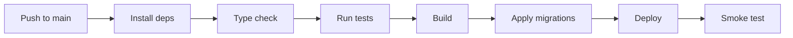

# Deployment Procedures

> Last updated: 2026-02-24

This document describes how to build, deploy, and roll back the Volleyball Ranking Engine.

## Build Process

### Prerequisites

- Node.js (compatible with Vite 7.3 and SvelteKit 2.50)
- npm
- Supabase CLI (`npx supabase` or globally installed)

### Build Commands

```bash
# Install dependencies
npm install

# Run type checking
npm run check

# Run test suite (180 tests across 36 files)
npx vitest run

# Build for production
npm run build
```

The `npm run build` command invokes `vite build`, which:

1. Runs `svelte-kit sync` to generate type declarations
2. Compiles all Svelte 5 components and TypeScript source
3. Bundles Tailwind CSS 4.2 via the Vite plugin (no PostCSS)
4. Applies the configured adapter to produce deployment artifacts
5. Outputs build artifacts to the `build/` directory (or adapter-specific location)

### Build Output

The output format depends on the active adapter:

| Adapter | Output | Artifact Location |
|---------|--------|-------------------|
| `adapter-auto` | Platform-detected | Varies by detected platform |
| `adapter-vercel` | Serverless functions + static | `.vercel/output/` |
| `adapter-netlify` | Edge functions + static | `.netlify/` |
| `adapter-node` | Node.js server | `build/` |
| `adapter-static` | Static HTML/CSS/JS | `build/` |

## Adapter Configuration

The project currently uses `@sveltejs/adapter-auto`:

```js
// svelte.config.js
import adapter from '@sveltejs/adapter-auto';

const config = {
  kit: {
    adapter: adapter()
  }
};

export default config;
```

`adapter-auto` automatically detects the deployment platform and selects the correct adapter. Supported auto-detection targets include Vercel, Netlify, and Cloudflare Pages.

### Switch to a Specific Adapter

Once a hosting platform is chosen, install the platform-specific adapter for deterministic builds:

**Vercel:**
```bash
npm install -D @sveltejs/adapter-vercel
```
```js
import adapter from '@sveltejs/adapter-vercel';
```

**Netlify:**
```bash
npm install -D @sveltejs/adapter-netlify
```
```js
import adapter from '@sveltejs/adapter-netlify';
```

**Node.js (self-hosted):**
```bash
npm install -D @sveltejs/adapter-node
```
```js
import adapter from '@sveltejs/adapter-node';
```

**Static (SSG):**
```bash
npm install -D @sveltejs/adapter-static
```
```js
import adapter from '@sveltejs/adapter-static';
```

> **Note**: The application uses server-side API routes (`+server.ts`) for ranking computation and data import. `adapter-static` will not support these routes. Use `adapter-node`, `adapter-vercel`, or `adapter-netlify` for full functionality.

## Environment Variable Configuration

### Production Environment Variables

Set these three variables in the hosting platform's environment configuration:

| Variable | Required | Scope |
|----------|----------|-------|
| `PUBLIC_SUPABASE_URL` | Yes | Available to both client and server |
| `PUBLIC_SUPABASE_PUBLISHABLE_DEFAULT_KEY` | Yes | Available to both client and server |
| `SUPABASE_SERVICE_ROLE_KEY` | Yes | Server-side only -- never exposed to the browser |

### Platform-Specific Configuration

**Vercel:**
1. Navigate to Project Settings > Environment Variables.
2. Add each variable. Mark `SUPABASE_SERVICE_ROLE_KEY` as "Sensitive" and restrict to server-side.
3. Select applicable environments (Production, Preview, Development).

**Netlify:**
1. Navigate to Site Configuration > Environment Variables.
2. Add each variable. Use "Secret values" for `SUPABASE_SERVICE_ROLE_KEY`.

**Node.js (self-hosted):**
1. Set environment variables in the host system, a `.env` file loaded by a process manager, or a secrets manager.
2. Start the server: `node build/index.js` (or use PM2, systemd, Docker).

## Database Migration Deployment

### Apply Migrations to Production

```bash
# Link to remote Supabase project (first time only)
supabase link --project-ref <project-ref>

# Push all pending migrations to the remote database
supabase db push
```

`supabase db push` applies any migrations in `supabase/migrations/` that have not yet been applied to the remote database. Migrations run in sequential order by filename timestamp.

### Verify Migration Status

```bash
# List all migrations and their applied status
supabase migration list
```

### Create a New Migration

```bash
# Generate a migration from local schema changes
supabase db diff -f <migration_name>

# Or create an empty migration file to write manually
supabase migration new <migration_name>
```

### Migration Safety Rules

- Never modify an already-applied migration file. Create a new migration instead.
- Test migrations locally first with `supabase db reset`.
- Back up the remote database before applying destructive migrations (DROP TABLE, ALTER COLUMN type changes).
- Review the generated SQL before pushing. `supabase db diff` can produce unexpected output for complex changes.

## Pre-Deployment Checklist

Complete all checks before deploying to production:

- [ ] **Tests pass**: Run `npx vitest run` and confirm all 180 tests pass across 36 files.
- [ ] **Type check passes**: Run `npm run check` with zero errors.
- [ ] **Build succeeds**: Run `npm run build` with zero errors.
- [ ] **Environment variables set**: Confirm all three Supabase variables are configured in the target environment.
- [ ] **Database migrations applied**: Run `supabase db push` and verify with `supabase migration list`.
- [ ] **Migration tested locally**: Run `supabase db reset` locally to verify all migrations apply cleanly from scratch.
- [ ] **No secrets in source**: Confirm `.env` is git-ignored and no credentials appear in committed files.
- [ ] **Preview tested**: Run `npm run preview` locally to verify the production build works.

## Deployment Steps

### Manual Deployment (Current Process)

1. Pull the latest code from the repository.
2. Complete the pre-deployment checklist above.
3. Apply database migrations:
   ```bash
   supabase link --project-ref <project-ref>
   supabase db push
   ```
4. Build the application:
   ```bash
   npm run build
   ```
5. Deploy the build artifacts to the hosting platform:
   - **Vercel/Netlify**: Push to the linked Git branch or use the platform CLI.
   - **Node.js**: Copy `build/` to the server and restart the process.
6. Verify the deployment:
   - Load the application in a browser.
   - Confirm the rankings dashboard renders data.
   - Test a ranking computation to verify database connectivity.

### Recommended Future CI/CD Pipeline



## Rollback Procedures

### Application Rollback

**If the application deployment fails or introduces a bug:**

1. Identify the last known good deployment artifact or commit.
2. Redeploy the previous version:
   - **Vercel/Netlify**: Use the platform's "Instant Rollback" feature from the deployment dashboard.
   - **Node.js**: Replace the `build/` directory with the previous version and restart the process.
3. Verify the rollback by loading the application and testing core functionality.

### Database Rollback

Supabase migrations are forward-only. There is no built-in `down` migration mechanism.

**If a migration causes issues:**

1. **Assess the damage**: Determine whether the migration caused data loss, schema corruption, or only an undesired schema change.
2. **Write a corrective migration**: Create a new migration that reverses the problematic changes:
   ```bash
   supabase migration new revert_<problematic_migration_name>
   ```
3. **Test the corrective migration locally**:
   ```bash
   supabase db reset
   ```
4. **Apply to production**:
   ```bash
   supabase db push
   ```
5. **If data was lost**: Restore from the most recent Supabase point-in-time backup via the Supabase Dashboard (Settings > Database > Backups).

### Partial Failure Recovery

If the deployment partially succeeds (e.g., migrations applied but application deploy fails):

1. Do not roll back the database migrations unless they are incompatible with the previous application version.
2. Ensure new migrations are backward-compatible (add columns with defaults, do not rename columns).
3. Redeploy the application. The previous application version should work with the new schema if migrations are backward-compatible.

## Maintenance Windows

Since there is no dedicated monitoring or load balancing:

- Schedule deployments during low-usage periods.
- Communicate planned downtime to the AAU committee users.
- Database migrations that lock tables (e.g., adding NOT NULL columns to large tables) should be run during off-hours.
