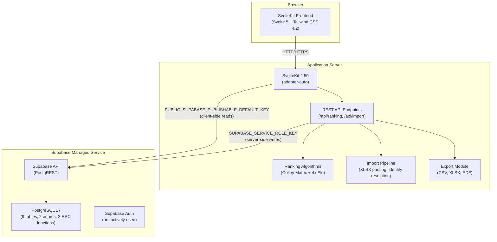
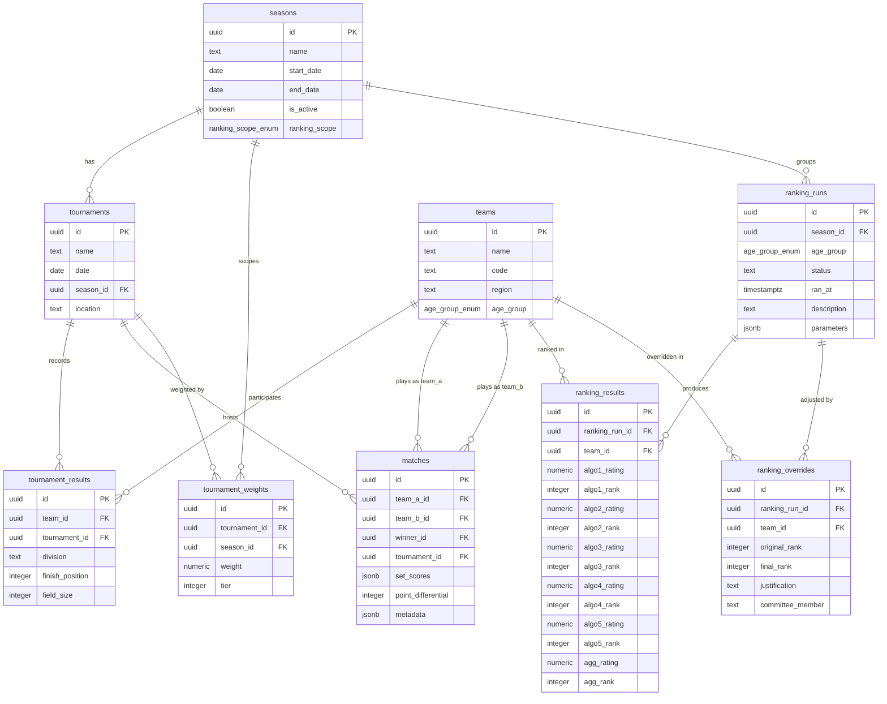

# Infrastructure Topology

> Last updated: 2026-02-24

This document describes the infrastructure components, database schema, and configuration for the Volleyball Ranking Engine.

## Architecture Diagram



## Supabase Project Configuration

The Supabase project is configured in `supabase/config.toml`:

| Setting | Value | Purpose |
|---------|-------|---------|
| `project_id` | `volleyball-ranking-engine` | Project identifier for local CLI |
| `db.port` | `54322` | Local PostgreSQL port |
| `db.shadow_port` | `54320` | Shadow database for `supabase db diff` |
| `db.major_version` | `17` | PostgreSQL major version (must match remote) |
| `api.port` | `54321` | Local PostgREST API port |
| `api.max_rows` | `1000` | Maximum rows per API response |
| `studio.port` | `54323` | Local Supabase Studio UI port |
| `db.pooler.enabled` | `false` | Connection pooler disabled locally |
| `db.migrations.enabled` | `true` | Migrations run on `db push` and `db reset` |
| `storage.file_size_limit` | `50MiB` | Maximum upload file size |

### Services Enabled Locally

| Service | Status | Notes |
|---------|--------|-------|
| API (PostgREST) | Enabled | Schemas: `public`, `graphql_public` |
| Realtime | Enabled | WebSocket subscriptions available |
| Auth | Enabled | Not actively used by the application |
| Storage | Enabled | S3-compatible protocol enabled |
| Studio | Enabled | Web UI at port 54323 |
| Edge Runtime | Enabled | Deno 2, per-worker policy |
| Analytics | Enabled | PostgreSQL backend, port 54327 |

## Database Schema

The database consists of 9 tables, 2 custom enums, 2 RPC functions, and 1 trigger function, deployed across 15 sequential migrations.

### Custom Enums

| Enum | Values | Purpose |
|------|--------|---------|
| `age_group_enum` | `15U`, `16U`, `17U`, `18U` | Competition age divisions |
| `ranking_scope_enum` | `single_season`, `cross_season` | Season ranking data scope |

### Entity-Relationship Diagram



### Table Details

#### `seasons`
Temporal grouping for tournaments and ranking runs.

- **Primary Key**: `id` (UUID)
- **Unique Constraints**: None
- **Foreign Keys**: None (root entity)
- **Notable**: `is_active` flag designates the current season; `ranking_scope` controls cross-season data aggregation.

#### `teams`
Teams identified by code and age group.

- **Primary Key**: `id` (UUID)
- **Unique Constraints**: `(code, age_group)` -- prevents duplicate teams within the same age division
- **Foreign Keys**: None (root entity)
- **Notable**: `code` is an opaque identifier from source data, not parsed or decomposed.

#### `tournaments`
Tournament events belonging to a season.

- **Primary Key**: `id` (UUID)
- **Foreign Keys**: `season_id` -> `seasons(id)` ON DELETE CASCADE
- **Indexes**: `season_id`

#### `tournament_weights`
Per-tournament, per-season importance multipliers.

- **Primary Key**: `id` (UUID)
- **Unique Constraints**: `(tournament_id, season_id)`
- **Foreign Keys**: `tournament_id` -> `tournaments(id)` CASCADE, `season_id` -> `seasons(id)` CASCADE
- **Indexes**: `tournament_id`, `season_id`
- **Notable**: `weight` is a numeric multiplier (0.0-5.0); `tier` is an integer grouping.

#### `tournament_results`
Team placement data at each tournament.

- **Primary Key**: `id` (UUID)
- **Unique Constraints**: `(team_id, tournament_id)` -- one result per team per tournament
- **Foreign Keys**: `team_id` -> `teams(id)` RESTRICT, `tournament_id` -> `tournaments(id)` CASCADE
- **Indexes**: `team_id`, `tournament_id`

#### `matches`
Individual game records between two teams.

- **Primary Key**: `id` (UUID)
- **Check Constraints**: `team_a_id != team_b_id`; `winner_id` must be `team_a_id` or `team_b_id` (or NULL)
- **Foreign Keys**: `team_a_id`, `team_b_id`, `winner_id` -> `teams(id)` RESTRICT; `tournament_id` -> `tournaments(id)` CASCADE
- **Indexes**: `team_a_id`, `team_b_id`, `tournament_id`
- **Notable**: `set_scores` (JSONB) and `point_differential` are nullable, reserved for future use.

#### `ranking_runs`
Point-in-time ranking computation snapshots.

- **Primary Key**: `id` (UUID)
- **Foreign Keys**: `season_id` -> `seasons(id)` CASCADE
- **Indexes**: `season_id`; composite `(season_id, age_group)`
- **Notable**: `status` is `draft` or `finalized` (CHECK constraint); `parameters` (JSONB) captures algorithm configuration at run time.

#### `ranking_results`
Per-team algorithm outputs for a ranking run.

- **Primary Key**: `id` (UUID)
- **Unique Constraints**: `(ranking_run_id, team_id)`
- **Foreign Keys**: `ranking_run_id` -> `ranking_runs(id)` CASCADE; `team_id` -> `teams(id)` RESTRICT
- **Indexes**: `ranking_run_id`, `team_id`
- **Algorithm Columns**: `algo1` = Colley Matrix, `algo2` = Elo-2200, `algo3` = Elo-2400, `algo4` = Elo-2500, `algo5` = Elo-2700

#### `ranking_overrides`
Committee manual adjustments with audit trail.

- **Primary Key**: `id` (UUID)
- **Unique Constraints**: `(ranking_run_id, team_id)` -- one override per team per run
- **Foreign Keys**: `ranking_run_id` -> `ranking_runs(id)` CASCADE; `team_id` -> `teams(id)` RESTRICT
- **Check Constraints**: `justification` >= 10 characters; `committee_member` >= 2 characters
- **Indexes**: `ranking_run_id`, `team_id`

### RPC Functions

| Function | Parameters | Purpose |
|----------|-----------|---------|
| `import_replace_tournament_results` | `p_season_id UUID`, `p_age_group TEXT`, `p_rows JSONB` | Atomically delete and re-insert all tournament results for a season + age group |
| `import_replace_ranking_results` | `p_ranking_run_id UUID`, `p_rows JSONB` | Atomically delete and re-insert all ranking results for a ranking run |

Both functions run within a single transaction (PostgreSQL function bodies are inherently transactional), ensuring no partial state on failure.

### Trigger Function

| Function | Purpose |
|----------|---------|
| `update_updated_at_column()` | Automatically sets `updated_at = now()` on every row update. Attached as a `BEFORE UPDATE` trigger on all 9 tables. |

## Migration Strategy

Migrations are managed by the Supabase CLI and stored in `supabase/migrations/` as sequentially numbered SQL files.

### Migration Naming Convention

```
YYYYMMDDHHMMSS_description.sql
```

Example: `20260223180005_create_teams_table.sql`

### Current Migrations (15 total)

| # | Migration | Purpose |
|---|-----------|---------|
| 01 | `create_updated_at_trigger_function` | Reusable `updated_at` trigger |
| 02 | `create_age_group_enum` | `age_group_enum` type |
| 03 | `create_ranking_scope_enum` | `ranking_scope_enum` type |
| 04 | `create_seasons_table` | Seasons with ranking scope |
| 05 | `create_teams_table` | Teams with code + age group uniqueness |
| 06 | `create_tournaments_table` | Tournament events |
| 07 | `create_tournament_weights_table` | Tournament importance multipliers |
| 08 | `create_tournament_results_table` | Team placements |
| 09 | `create_matches_table` | Individual game records |
| 10 | `create_ranking_runs_table` | Ranking computation snapshots |
| 11 | `create_ranking_results_table` | Per-team algorithm scores |
| 12 | `create_import_replace_rpc` | Atomic import RPC functions |
| 13 | `add_ranking_run_status` | Draft/finalized workflow |
| 14 | `create_ranking_overrides_table` | Committee override audit trail |
| 15 | `add_age_group_to_ranking_runs` | Per-age-group ranking runs |

### Migration Commands

```bash
# Apply pending migrations to remote database
supabase db push

# Reset local database (drop and recreate with all migrations + seeds)
supabase db reset

# Generate a new migration from schema diff
supabase db diff -f <migration_name>

# Check migration status
supabase migration list
```

## Environment Variables

### Required for Application

| Variable | Scope | Example | Source |
|----------|-------|---------|--------|
| `PUBLIC_SUPABASE_URL` | Client + Server | `https://<project-ref>.supabase.co` | Supabase Dashboard > Settings > API |
| `PUBLIC_SUPABASE_PUBLISHABLE_DEFAULT_KEY` | Client | `sb_publishable_...` | Supabase Dashboard > Settings > API |
| `SUPABASE_SERVICE_ROLE_KEY` | Server only | `sb_secret_...` | Supabase Dashboard > Settings > API |

### Supabase Client Architecture

The application uses two Supabase clients:

1. **Browser client** (`src/lib/supabase.ts`): Uses `PUBLIC_SUPABASE_PUBLISHABLE_DEFAULT_KEY` via `import.meta.env`. Safe for client-side reads. Respects Row Level Security policies.
2. **Server client** (`src/lib/supabase-server.ts`): Uses `SUPABASE_SERVICE_ROLE_KEY` via `$env/static/private`. Bypasses RLS for server-side write operations. Restricted to `+server.ts`, `+page.server.ts`, and `hooks.server.ts`.

### Local Development

Store variables in `.env` at the project root:

```env
PUBLIC_SUPABASE_URL=https://<project-ref>.supabase.co
PUBLIC_SUPABASE_PUBLISHABLE_DEFAULT_KEY=sb_publishable_...
SUPABASE_SERVICE_ROLE_KEY=sb_secret_...
```

The `.env` file is git-ignored. Never commit credentials to source control.
