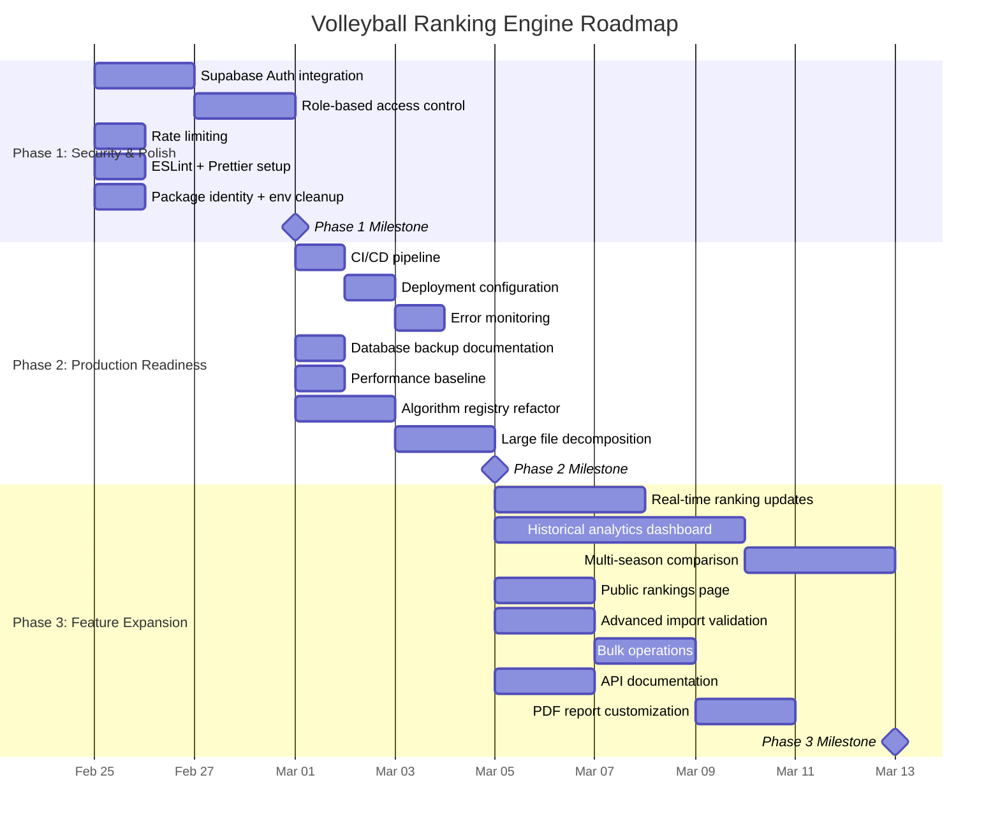

# Future Roadmap

**Project:** Volleyball Ranking Engine
**Date:** 2026-02-24
**Status:** All 9 planned features complete
**Audience:** Technical leadership, project stakeholders

---

## Current State

The Volleyball Ranking Engine has delivered all nine planned features:

1. Data Model and Database Schema
2. Ranking Algorithm Engine (Colley Matrix + 4 Elo variants)
3. Data Ingestion Pipeline (XLSX import with identity resolution)
4. Rankings Dashboard (results display, run management)
5. Tournament Weighting and Seeding Factors
6. Committee Override System (with audit trail)
7. Export Module (CSV, XLSX, PDF)
8. Run Finalization and Audit
9. Multi-Age-Group Support (15U, 16U, 17U, 18U)

The system is **feature-complete but not production-ready.** The gap is primarily security (no authentication), operational tooling (no CI/CD, no monitoring), and deployment infrastructure (no hosting configuration).

---

## Phased Roadmap

### Phase 1: Security and Polish (Weeks 1-3)

**Goal:** Make the application safe to deploy to a controlled audience.

**Business justification:** Without authentication, any user can manipulate official rankings. This is the single largest risk to organizational credibility. Every week of delay increases the window during which an accidental or malicious ranking change could occur if the application is exposed.

| Task | Description | Effort | Dependencies |
|------|-------------|--------|--------------|
| Supabase Auth integration | Email/password login for committee members; session management via SvelteKit hooks | 2 days | None |
| Role-based access control | Three roles: `admin`, `committee`, `viewer`; enforce via RLS policies and API middleware | 1.5 days | Auth integration |
| Rate limiting | Throttle API endpoints to prevent abuse; protect CPU-intensive ranking computation | 1 day | None |
| ESLint + Prettier setup | Code style enforcement with auto-fix; Svelte and TypeScript plugins | 0.5 days | None |
| Package identity | Rename from "svelte-scaffold" to "volleyball-ranking-engine"; set version to 1.0.0 | 0.5 hours | None |
| Environment variable cleanup | Migrate client-side `import.meta.env` to `$env/static/public` for consistency | 0.5 hours | None |

**Phase 1 exit criteria:**
- All API endpoints require authentication
- Committee actions (overrides, finalization) require `committee` or `admin` role
- CI pipeline rejects PRs that fail type checking, linting, or tests
- Package.json reflects correct project identity

### Phase 2: Production Readiness (Weeks 4-6)

**Goal:** Deploy the application to production with confidence in reliability and observability.

**Business justification:** A ranking system that goes down during tournament season or loses data during a computation erodes trust just as quickly as a security breach. Production readiness protects the organization's investment in the ranking platform.

| Task | Description | Effort | Dependencies |
|------|-------------|--------|--------------|
| CI/CD pipeline | GitHub Actions: install, lint, type-check, test, build on every PR; deploy on merge to main | 1 day | ESLint setup |
| Deployment configuration | Choose hosting platform (Vercel recommended for SvelteKit); configure adapter, environment variables, preview deployments | 1 day | CI pipeline |
| Error monitoring | Integrate Sentry or equivalent; capture unhandled errors, slow API responses, failed ranking computations | 0.5 days | Deployment |
| Database backup documentation | Document Supabase backup schedule, point-in-time recovery, RTO/RPO targets | 0.5 days | None |
| Performance baseline | Benchmark ranking computation time by team count (50, 100, 200, 500 teams); establish SLOs | 1 day | None |
| Algorithm refactor (phase 1) | Extract algo1-algo5 into a dynamic algorithm registry in the ranking engine and normalize modules | 2 days | None |
| Large file decomposition | Split `import-service.ts` (487 lines) and `ranking-service.ts` (393 lines) into focused modules | 1.5 days | None |

**Phase 2 exit criteria:**
- Application deployed to production with automated CI/CD
- Error monitoring active with alerts for unhandled exceptions
- Ranking computation benchmarked with documented SLOs
- Algorithm registry replaces hardcoded algo1-algo5 in core modules

### Phase 3: Feature Expansion (Weeks 7-14)

**Goal:** Differentiate the platform with capabilities that competing ranking systems do not offer.

**Business justification:** With security and reliability in place, the ranking engine becomes a strategic asset. The features in Phase 3 transform it from a computation tool into a decision-support platform that increases engagement from coaches, parents, and committee members.

| Task | Description | Effort | Dependencies |
|------|-------------|--------|--------------|
| Real-time ranking updates | WebSocket or server-sent events for live ranking changes during active computation; shows progress and intermediate results | 3 days | Deployment |
| Historical analytics dashboard | Trend visualization: team rank trajectory across ranking runs; season-over-season comparison; algorithm agreement/divergence charts | 5 days | Algorithm registry |
| Multi-season comparison | Side-by-side view of team performance across 2+ seasons; identify improving and declining programs | 3 days | Historical analytics |
| Advanced import validation | Stricter data quality checks: detect impossible scores, flag suspicious patterns (e.g., team beats every opponent by the same margin), warn on data staleness | 2 days | None |
| Bulk operations | Batch import of multiple tournament XLSX files; batch weight adjustments; batch override application | 2 days | None |
| Public rankings page | Read-only, unauthenticated rankings view with shareable URLs for each age group; mobile-optimized for parents checking from tournaments | 2 days | Auth + roles |
| API documentation | OpenAPI/Swagger specification auto-generated from endpoint types; interactive API explorer for integrators | 1.5 days | None |
| PDF report customization | Committee-branded PDF exports with logo, custom headers, and configurable column selection | 1.5 days | None |

**Phase 3 exit criteria:**
- At least 3 of the above features shipped
- User feedback collected from committee members after first production season
- Roadmap for Season 2 defined based on operational learnings

---

## Timeline Visualization

---

## Investment Justification

### Phase 1 (Security and Polish)

| Metric | Value |
|--------|-------|
| Estimated effort | 5.5 developer-days |
| Risk mitigated | Unauthorized ranking manipulation; loss of organizational credibility |
| ROI horizon | Immediate -- unlocks controlled production deployment |

Without Phase 1, the application cannot be deployed to any audience. The ranking engine's entire value proposition depends on stakeholders trusting the output. Unauthorized modification capability eliminates that trust.

### Phase 2 (Production Readiness)

| Metric | Value |
|--------|-------|
| Estimated effort | 7.5 developer-days |
| Risk mitigated | Data loss, undetected failures, regression introduction, deployment errors |
| ROI horizon | 2-4 weeks -- operational savings begin immediately upon first automated deployment |

Manual deployments consume developer time and introduce human error risk. CI/CD and monitoring pay for themselves within the first month of active use. The algorithm registry refactor reduces the cost of every future algorithm change from days to hours.

### Phase 3 (Feature Expansion)

| Metric | Value |
|--------|-------|
| Estimated effort | 20 developer-days (full scope) |
| Value created | Platform differentiation; increased stakeholder engagement; decision-support capabilities |
| ROI horizon | 1-2 seasons -- value accrues as historical data grows |

Phase 3 transforms the ranking engine from a computation utility into a strategic platform. Historical analytics and multi-season comparison create value that grows with each season of data, creating switching costs and deepening organizational commitment to the platform.

---

## Decision Points

The following decisions should be made before Phase 2 begins:

1. **Hosting platform selection.** Vercel is recommended for SvelteKit applications (first-class adapter support, edge functions, preview deployments). Alternatives: Netlify, Cloudflare Pages, or self-hosted Node.js.

2. **Authentication provider scope.** Should authentication be limited to committee members (email/password via Supabase Auth), or should it support organizational SSO (SAML/OIDC) for larger AAU regions?

3. **Public access model.** Should final rankings be publicly viewable without login? If yes, the `viewer` role may not require authentication, only committee write operations.

4. **Algorithm evolution strategy.** Is there a concrete plan to add a sixth algorithm or modify the existing five? If not, the algorithm registry refactor (DEBT-003) can be deferred to Phase 3 without significant risk.

5. **Multi-region support.** Will the platform serve a single AAU region or multiple regions? Multi-region support would affect database schema (region isolation), authentication (per-region admins), and deployment (latency considerations).

---

## Success Metrics

| Phase | Metric | Target |
|-------|--------|--------|
| Phase 1 | Zero unauthorized API calls in production | 100% |
| Phase 1 | All PRs pass automated quality gates | 100% |
| Phase 2 | Mean time to deploy a change | < 15 minutes |
| Phase 2 | Error detection latency | < 5 minutes |
| Phase 2 | Ranking computation for 200 teams | < 10 seconds |
| Phase 3 | Committee member engagement (weekly active users) | > 80% of committee |
| Phase 3 | Public page unique visitors per ranking publication | Baseline + 50% growth |

---

## Risk Register

| Risk | Likelihood | Impact | Mitigation |
|------|-----------|--------|------------|
| Security incident before Phase 1 completion | Medium | Critical | Do not expose the application on public internet until auth is in place |
| Algorithm registry refactor introduces ranking discrepancies | Low | High | Run old and new implementations in parallel; compare outputs for N ranking runs before cutover |
| Supabase service disruption during tournament season | Low | High | Document disaster recovery procedures; evaluate read replica for redundancy |
| Scope creep in Phase 3 delays critical Phase 1/2 work | Medium | Medium | Enforce phase sequencing; Phase 3 does not begin until Phase 2 exit criteria are met |
| Single-developer dependency | High | Medium | Complete developer onboarding documentation; CI/CD reduces bus factor impact |
